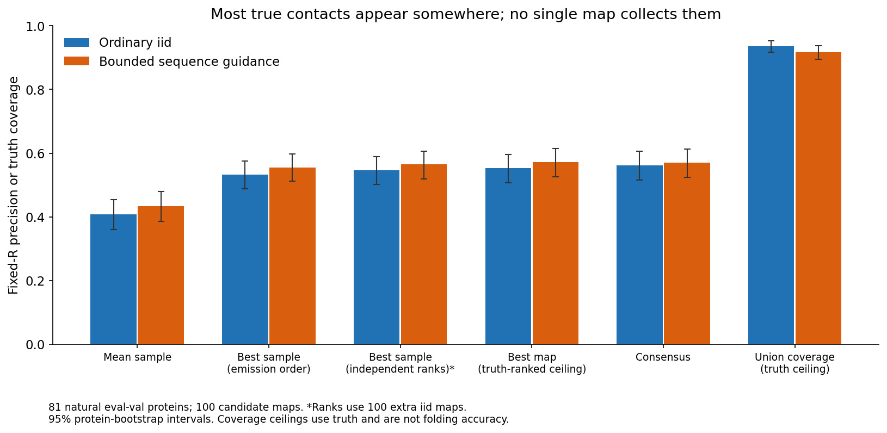
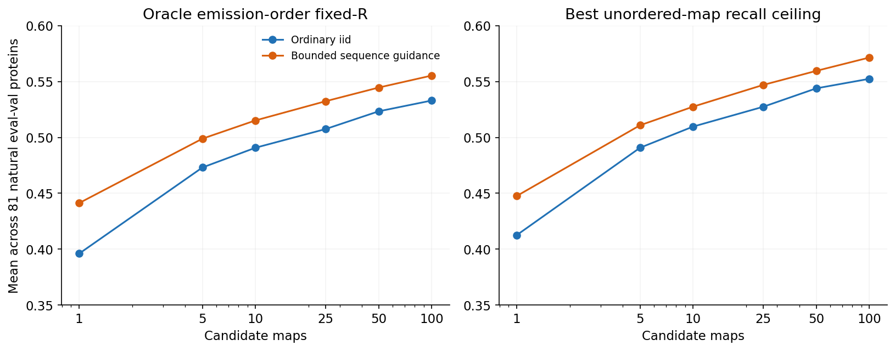
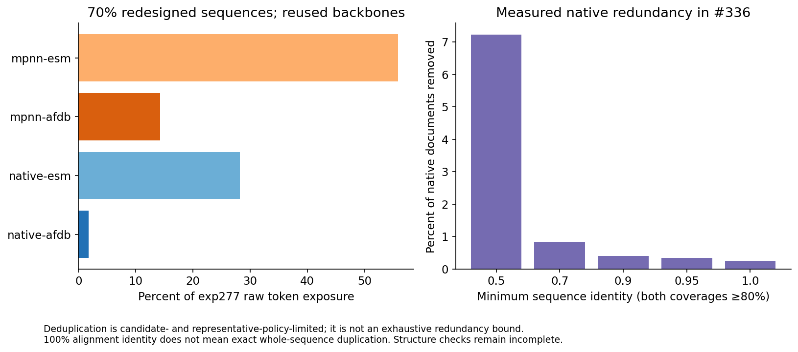

# MarinFold: why more diverse rollouts have not solved accuracy

**Research report · September 26, 2026 · [Experiment #339](https://github.com/Open-Athena/MarinFold/issues/339)**

## Assessment

**I would keep MarinFold as a research platform, but stop treating greater inference diversity as the main route to a competitive general-purpose folding model.** The strongest diagnosis is insufficient sequence-specific accuracy, combined with a training distribution dominated by single predicted structures and a mismatch between the output, training objective, and evaluation. Ordinary sampling already explores many contact sets. It often discovers correct contacts individually without putting enough of them into one accurate hypothesis.

The memorization hypothesis is too strong in its literal form. MarinFold does substantially more than the tested sequence-nearest-neighbor baseline, including after sequence decontamination. That does **not** demonstrate fold-disjoint generalization or exclude implicit template-like computation. We have not done the causal experiment that would establish that. Training redundancy is real, but the native-corpus audit does not support the story that nearly all training examples are close duplicates. More consequential repetition in the current model is deliberate: approximately 70% of token exposure consists of redesigned sequences on already represented backbones.

My recommendation is a bounded change of direction:

1. Keep the first-epoch exp277 checkpoint and ordinary rollout consensus as controls. Do not buy another unchanged epoch or another broad search over novelty penalties.
2. Prioritize sequence-conditioned contact scoring, native-versus-redesign exposure, and supervision that represents uncertainty or distinct structural states. Test these separately, with matched controls.
3. Evaluate individual-map correctness, consensus quality, and reconstructed 3D accuracy separately. Retain a selector only if it improves a deployable result at matched compute.
4. If this focused phase cannot produce a replicated, material natural-protein improvement, stop scaling the current contact-string recipe. Reuse its data and interfaces in a stronger sequence encoder plus pair/structure prediction system, or narrow the goal to interpretable constraints and experimental conditioning.

This assessment combines a review of the modeling/data strategy with **new analysis of 29,100 previously generated rollouts**, including checksummed public inputs, code, per-protein results, and plots. Existing artifacts were sufficient to distinguish the leading explanations; no new training or GPU inference was needed. No new eval-test scores were computed.

## Scope and current model

The registered default is **`contacts-v1-exp277-m2-p06-full-epoch-1.5B`, step 266344**. It is a Qwen3-style decoder trained from scratch: 24 layers, hidden width 2048, 32 attention heads/8 KV heads, vocabulary 2845, context 8192, global batch 128, peak learning rate 0.001 and weight decay 0.2. It uses packed documents, blocked cross-document attention, and scheduled amino-acid statement-order augmentation. These are verified in [exp232's training contract](../exp232_sweep_cv1_decontam/training_contract.py), [exp277's trainer](../exp277_models_single_mpnn_pilot/train.py), and [its epoch dataset](../exp277_models_single_mpnn_pilot/epoch_data.py).

**The second epoch has completed**, although the main-branch README still describes it as in progress. Its paired evaluation reports natural eval-val R **0.55510 → 0.55750**, difference **+0.00240 [−0.00644, +0.01102]**. Best validation loss improved only 0.00175 nats. This is a practical tie, not a useful new default. The second epoch also produced more capped rollouts. [Exp277 completion and evaluation](https://github.com/Open-Athena/MarinFold/issues/277), [continuation PR #297](https://github.com/Open-Athena/MarinFold/pull/297).

I examined the generator, scoring code, current training recipe, overlap/decontamination and deduplication audits, redesign experiment, refinement/RL results, recent inference interventions, and fold-switching/Helico experiments. Historical models and recipes are identified below rather than pooled into a misleading learning curve.

The new analysis covers all 97 natural eval-val proteins in exp321. Main tables use its 81-protein confirmation partition, keeping the original 16 development proteins separate. **These 81 are previously evaluated validation proteins, not a fresh held-out test for this report.** The CSV label `split=test` is inherited from exp321 and does not mean `eval-test`. Bootstrap intervals resample proteins; they do not cover training-seed variation, experimental selection, or all stochastic inference variation.

## 1. Is every rollout actually the same?

Three kinds of diversity must be distinguished:

| Kind | What differs | What it cannot establish |
|---|---|---|
| Serialization | Statement orders and position realizations | Different structural predictions |
| Contact sets | Residue pairs, including both true and false pairs | Different valid folds |
| Structural states | Accurate, reconstructable conformations | Correct physical populations without further supervision |

In the 81-protein main comparison, **every protein has 100 distinct contact sets among its first 100 samples**. That remains true with bounded sequence guidance. Exp321 reports mean pairwise Jaccard **0.2846** for iid and **0.3334** for guidance. Literal duplicate-map collapse is therefore not the problem. But these are not necessarily 100 different folds: endpoint jitter, subsets of one topology, and mistakes can all yield distinct contact maps inside one structural basin.

### New experiment: decompose coverage, ranking, and map quality

I read 194 raw parquets: 200 iid and 100 guided rollouts for each of 97 proteins. The first 100 iid maps and all guided maps are candidates. The second 100 iid maps provide independent contact-frequency rankings. There were **zero new predictor runs**. The raw inputs total 35,945,487 bytes and have individual SHA-256 hashes in [raw_manifest.csv](data/raw_manifest.csv); a fresh anonymous download verified every file.

Before computing new diagnostics, I reproduced exp321's consensus and validity-gated best-of-100 metrics across **324 protein/arm/range rows per metric**, with maximum absolute error **8.4×10⁻¹⁷**. The resolved-residue universe, degree threshold 0.001, and separations ≥6/≥24 are unchanged. Invalid maps receive zero primary oracle credit and are excluded from the new union diagnostic, making our union values slightly lower than exp321's unfiltered values. Excluding invalid maps from consensus changes the score negligibly. [Code](analyze.py), [provenance](data/provenance.json).

| All-range metric; 81 natural proteins | Ordinary iid | Bounded guidance |
|---|---:|---:|
| Mean sample, emission-order fixed-R | 0.4073 | 0.4340 |
| Best of 100, emission-order fixed-R | 0.5331 | 0.5554 |
| Best of 100 after independent frequency ranking* | 0.5468 | 0.5642 |
| Best existing map with perfect truth-based internal ranking† | 0.5525 | 0.5716 |
| Published consensus, 100 maps | 0.5625 | 0.5695 |
| True-contact union recall, valid maps† | 0.9362 | 0.9174 |
| Mean emitted contacts / true contacts | 1.0002 | 0.9434 |
| Distinct maps, out of 100 | 100 | 100 |

\* Uses **100 additional iid maps** for ranking: a 200-map computation, not a free gain at the 100-map budget. Selecting the best map still uses truth. † Oracle ceilings, not deployable accuracy or claims of 3D realizability. [Per-protein results](data/per_protein.csv), [summary](data/summary.csv).



### Why the oracle can lose to consensus

Let `T` be the true contact set and `R=|T|`. A rollout is an ordered list `C`. Exp321's individual-map metric counts true contacts in the first R distinct statements, divides by R, and gives zero credit to unfilled positions in a short map. Its oracle selects the best such list among the samples. Consensus constructs a **new list**, sorting contact frequencies across all maps. That list can include contacts no individual map assembled together.

Best-of-100 is therefore an upper bound on **selecting one emission-ranked sample**, not everything computable from 100 samples. Emission order is also not calibrated confidence: training presents contacts in random order.

The new measurements show the size of the issue. Expected fixed-R precision under a random permutation of each iid map is **0.4062**, versus actual emission-order precision **0.4073**: only **+0.00109 [0.00083, 0.00136]**. Independent-frequency ranking improves oracle best-of-100 by **+0.01368 [0.01055, 0.01702]**. Even perfect truth-based internal ranking improves it only **+0.01944 [0.01540, 0.02375]**. Ranking matters, but cannot explain the whole deficit.

The much larger gap is between correct contacts distributed through the pool and correct contacts jointly present in its best map: **0.9362 − 0.5525 = 0.3836 [0.3514, 0.4160]**. There is a substantial supply of true contacts surrounded by many false alternatives. This does **not** imply that a learned aggregator can reach 94% accuracy: recognizing those contacts is the unsolved problem, and a union is not a fold.

As a simple control, I selected a map by summed independent-pool frequencies over its top **L** contacts, then evaluated its frequency-ranked contacts at R. Selection uses sequence length and raw contacts, never true R, reference labels, or the reference-resolved mask. It scores **0.5115** for iid and **0.5156** for guidance—better than an average sample, but worse than ordinary consensus despite the extra ranking pool. Raw native-NLL selection scores only **0.3771/0.3963**. Neither is recommended for deployment. A useful scorer must predict sequence-specific correctness, not simply commonness or likelihood.

### Under-generation and sampling saturation

Iid samples emit **1.0002×** the true contact count on average. The mean per-protein best cardinality-only ceiling is **0.9994**: almost every protein has a sample with enough contacts to score well in principle. About 45% of samples are shorter than R, so stopping behavior matters locally, but there is no global contact shortage of the old magnitude.

Exp142's historical under-generation probe used top-k 50. Exp82 subsequently showed that disabling top-k changed mean predicted/true counts from 0.67 to 0.96. That historical decoding issue should not be projected onto the current top-k-disabled model. [Exp142](../exp142_evals_short_document_bias/README.md), [exp82](../exp82_evals_contacts_v1_contact_prediction/README.md).

Sampling gains diminish but do not disappear: iid best-of-50 is **0.5234**, best-of-100 **0.5331**, a paired **+0.00966 [0.00651, 0.01324]**. This does not establish an asymptotic ceiling. It does explain why multiplying inference cost is a weak plan for closing a roughly quarter-point gap to strong natural-protein baselines.



## 2. The clearest intervention improves quality while reducing diversity

Exp321 compares bounded guidance, temperature controls, and a pure-ratio decoder on the same model and targets. Its selected rule is:

`guided_logits = native_logits + 0.5 × (native_logits − polyalanine_logits)`

On its 81-protein confirmation partition, this raises oracle R **0.5331 → 0.5554**, **+0.02235 [0.01588, 0.02899]**. It beats T=0.8 and T=1.1 controls, and beats an equal-H100-time iid pool by **+0.01714 [0.01149, 0.02293]**. Mean quality rises, Jaccard rises, and union recall falls. The new analysis confirms better actual map content: even the truth-ranked best-map ceiling improves **0.5525 → 0.5716**.

Conversely, the pure native/null ratio broadens support—union recall **0.9612**, Jaccard **0.2552**—but lowers oracle R to **0.4774** and causes many more malformed/unfinished samples. T=1.1 lowers oracle R to **0.5169**. More novelty alone goes in the wrong direction. [Exp321 controls and timing](../exp321_evals_null_sequence_contrastive_guidance_for_contacts/README.md).

My interpretation is that the generic structural/contact prior is useful but can outweigh sequence-specific evidence. Bounded contrast strengthens that evidence; removing the base distribution amplifies a weak signal into noise. This is an inference from the intervention, not a full causal decomposition. Polyalanine is an out-of-distribution reference, not a clean deletion of only one biological factor.

Other inference experiments reinforce the finding:

| Intervention | Result | Implication |
|---|---|---|
| Contact-cluster seeding, exp326 | Confirmation oracle Δ −0.0035; no advantage over coherent random seeds | Co-occurrence clusters fail to supply useful missing modes |
| Whole-map medoids, exp328 | Both seed sizes fail development; seed truth precision 17–18% versus 29–31% for random controls | Distinctive model contacts are disproportionately wrong |
| Contact-block beam, exp306 | Natural consensus Δ −0.01193; fold-switch dual contact hits 2/29 versus 6/29 iid | Higher model likelihood is not better coverage |
| Early novelty penalty, exp308 | Dual contact hits 1/29 versus 6/29; 27.3× iid generation time | Novelty is an expensive failed objective here |
| Alanine masking, exp333 | 5% masking worsens oracle accuracy versus its own zero-mask control; no policy passes the gate | Query corruption is not useful generic exploration |

Sources: [exp326](../exp326_evals_contact_cluster_branching/README.md), [exp328](../exp328_evals_whole_map_medoid_branching/README.md), [exp306](https://github.com/Open-Athena/MarinFold/issues/306), [exp308](https://github.com/Open-Athena/MarinFold/issues/308), [exp333](https://github.com/Open-Athena/MarinFold/issues/333). Exp333 also had a cross-worker zero-mask discrepancy exceeding 0.005; its within-worker dose response is more defensible than cross-worker effect sizes.

These are overlapping validation/stress-test studies, not independent replications of one hypothesis. They nevertheless provide little reason for another broad decoding sweep without a substantially different mechanism.

## 3. Are we memorizing folds or aligning against training sequences?

**Literal nearest-neighbor copying is not the best explanation. Implicit reliance on familiar fold templates remains possible.**

The old corpus really was contaminated with evaluation homologs. Exp213 found significant homologs for 323/554 legacy targets across AFDB and ESM-Atlas; ESM supplied relatives missed by checking AFDB alone. Early headline scores are not clean measurements of remote generalization. Its natural-only identity correlation was near zero for MarinFold and positive for KNN, evidence against a simple copying model, but a null correlation cannot exclude retrieval-like internal computation. [Exp213](../exp213_evals_train_sequence_overlap_audit/README.md).

The current native corpus has a different, verified filter. Exp225 removed alignments with identity ≥30% and coverage ≥50% of the shorter sequence against the union of the legacy set and all FoldBench chains. **The final published filter did not include the additional E-value arm or a fold-level purge.** No surviving matches satisfied the applied rule in the published check. Short fragments, remote homologs, and structural similarities remain possible. “Sequence-decontaminated” is accurate; “no homologs” and “fold-disjoint” are not. [Exp225](../exp225_data_decontaminate_training_corpora/README.md), [verification](../exp245_evals_foldbench_held_out_monomers/data/decontamination_check.json).

Current natural performance clears the tested **native-corpus** KNN null:

| Predictor; same 97 natural eval-val targets | All-range R |
|---|---:|
| Protenix-v2 + MSA | 0.8460 |
| ESMFold2 | 0.8015 |
| ESMFold | 0.7504 |
| MarinFold exp277 | 0.5537 |
| MarinFold exp232 native-only reference | 0.5517 |
| Sequence-KNN, native decontaminated corpus | 0.4071 |
| Protenix-v2 single sequence | 0.2632 |

Source: [exp277 matched table](../exp277_models_single_mpnn_pilot/data/eval_rollout_v2/figure_summary.csv). These are contact metrics, not 3D scores. **This KNN index does not contain exp277's redesigned sequences.** Clearing it is meaningful, but does not establish superiority to retrieval over the entire current training corpus. Building that null and checking redesign-generated overlap are still worthwhile; I have not silently assumed them away.

Sequence novelty also does not imply fold novelty. In exp213, only 37 of 231 sequence-novel legacy proteins were also Foldseek-novel against AFDB representatives. That historical result has benchmark-composition and indexing limitations, but illustrates why the two axes must be separated. Removing all familiar folds also changes the training problem; it is not automatically a better recipe for practical sequence generalization.

The stronger memorization claim needs a **controlled intervention**. Train matched models with close homologs removed, then with near-structural neighbors removed, replacing removed tokens with matched unrelated examples. Use a prospectively frozen natural panel stratified by sequence identity, structural similarity, length, and MSA depth, with sequence and structure-transfer nulls. A performance loss specific to removing a target's structural neighborhood would support template dependence. Attribution plots, a single identity threshold, or score correlations cannot settle this causal question.

## 4. Are there too many similar training proteins?

### Native-corpus redundancy is moderate under the measured procedure

The newer exp336 audit analyzes the **69,516,181-document** native decontaminated corpus. Direct alignments and an already-retained-witness selector give:

| Minimum identity; ≥80% coverage of both chains | Documents removed | Fraction |
|---|---:|---:|
| 50% | 5,022,836 | 7.225% |
| 70% | 587,171 | 0.845% |
| 90% | 276,929 | 0.398% |
| 95% | 241,208 | 0.347% |
| 100% aligned identity | 176,767 | 0.254% |

The 100% row is **not exact whole-sequence duplication**. The result depends on approximate candidates and representative policy; its graph is frozen from a 50% Linclust candidate pass. It is not an exhaustive bound on corpus redundancy. Full structural/contact validation, exact pooled token accounting, and lower-identity sweeps remain unfinished. Structural checks can rescue members of this fixed proposed-removal set; 7.225% is not the completed joint 50%/TM-0.7 answer. [Exp336 at 9aaa1451](https://github.com/Open-Athena/MarinFold/blob/9aaa1451dfd6a35404b67b3493e4db538acb347a/experiments/exp336_evals_structure_aware_training_corpus_dedup/README.md), [copied source table](data/redundancy_source.csv).

AFDB's removal share is **16.833%**, versus ESM's **6.645%**. Earlier cluster labels alone would miss this. Conversely, a structure-only one-per-Foldseek-cluster rule would remove **76.6% of current AFDB**, potentially discarding useful sequence diversity. Clustering and safe deduplication are different operations.

### Current training repeats backbones much more than that audit suggests

Exp277 sees **232,090,905 documents and 248.584 billion raw tokens** in its full epoch:

| Source | Documents | Raw-token share |
|---|---:|---:|
| Native AFDB | 3,963,003 | 1.78% |
| Native ESM-Atlas | 65,553,178 | 28.18% |
| MPNN redesigns of AFDB backbones | 31,702,680 | 14.22% |
| MPNN redesigns of ESM backbones | 130,872,044 | 55.82% |

Thus **70.04% of exposure is redesign**, and **84.00% derives from ESM-source backbones**. Those weights arise from corpus concatenation, not a controlled demonstration that they are optimal. Redesign changes sequence and recomputes sequence-dependent side-chain contact labels, but adds no new backbone conformation. Document count therefore overstates independent structural supervision. [Computed exposure](data/training_exposure.csv), [exp277 census](../exp277_models_single_mpnn_pilot/data/epoch_corpus_counts.csv), [exp266](../exp266_data_mpnn_redesign_contacts_v1/README.md).



The outcome matches a distribution-shift concern: relative to the native-only exp232 reference, exp277 changes natural eval-val R by **+0.0020 [−0.0084, +0.0130]**, but improves the 19-protein de novo sanity set by **+0.0860 [0.0398, 0.1392]**. It is plausible that redesign-heavy training allocates capacity toward design-like sequence/structure relationships. This is not causal proof: exposure, training duration and runtime differ, and there is one training seed. A matched-budget native-versus-redesign mixture experiment is missing.

Another bias deserves attention: AFDB selection originally **discarded structural clusters with fewer than three usable members**, dropping 718,997 of 1,679,067 source clusters. This could remove rare structural neighborhoods disproportionately. Those rows are not all high-quality or useful, so the count is not a count of lost novel folds. But it strongly motivates a quality-controlled rare-cluster recovery experiment. [Exp53 selection](../exp53_data_contacts_v1_zephyr/README.md).

The prospective exp292 supplement is also not 13.7 million demonstrated new conformations. Its completed selection contains **92,511 strict structural-diversity additions out of 13,732,374 total, 0.67%**; most rows are quality-fill. The threshold is conservative and a minority could matter disproportionately, but total volume is not measured state diversity. [Exp292 final selection](https://github.com/Open-Athena/MarinFold/issues/292).

**Recommendation:** finish the joint audit and test moderate backbone/cluster weighting. Preserve structurally discordant examples of similar sequences. Do not automatically delete all familiar folds, and do not equate another million synthetic sequences with another million structural hypotheses.

## 5. More subtle limitations in the modeling strategy

### Single-structure distillation does not teach physical ensembles

Most supervision comes from AFDB/ESMFold-derived predicted backbones. The model can learn contact serializations and a distribution of imperfect guesses without learning the physical ensemble conditional on sequence, ligand, oligomeric state, environment, or experimental condition. Several of these variables are absent from the monomer prompt. An alternative state can be missing from the teacher data or unknowable from the provided sequence alone.

Exp301 found Fold1-like versus Fold2-like training structures at **30:4**. Model/training agreement was 76%, but the marginal preferences already predicted 75%; the study could not distinguish copying from shared teacher bias. This establishes neither a memorization mechanism nor a clean counterexample to one. [Exp301 pinned report](https://github.com/Open-Athena/MarinFold/blob/5f51117c6159064341d343bb89ae52c55f6ae24f/experiments/exp301_evals_fold_switching_proteins/README.md).

Roughly ten supplied true alternative-fold contacts could steer many targets toward the alternative. That establishes **conditional completion capability**. Near-equal mean teacher-forced NLL for two maps does not establish equal free-generation probability: per-token means conceal accumulated probability differences, teacher forcing provides the correct prefix, and each map has many serializations. I would not adopt the strongest claim that this proves a purely sampling—not representational—problem. Finding a correct prefix without truth remains the challenge subsequent branching experiments failed to solve.

### Random-order autoregression can reward completion more than sequence inference

The [contacts-v1 format](../../marinfold/marinfold/document_structures/contacts_v1/README.md) wraps positions over 2000 indices, shuffles sequence statements, chooses contacts by degree, and emits them in random order as three-token statements. During teacher forcing, later contacts are predicted with a correct partial structure present. During generation, later contacts inherit earlier errors. A strong geometry-completion prior can lower language-model loss while leaving the first sequence-to-fold decision weak.

The model also spends capacity learning a set serialization and index grammar. Current augmentation shuffles amino-acid statement order; its implementation leaves the structure section unchanged. Re-epoching does not automatically provide fresh structural labels or contact order. These facts motivate measuring prefix-dependent sequence reliance and testing objectives, not declaring autoregression intrinsically unsuitable. Historical augmentation gains and the failure of NoPE/token smearing show why plausible architecture stories require full-budget validation. [Exp166](../exp166_models_contacts_v1_aa_augmentation/README.md), [exp262](../exp262_models_nope_token_smearing/README.md).

### Coherence, contact correctness and 3D correctness are different

Exp211 found that rollout maps beat marginal-matched chimeras on a statistical geometry-consistency score. Yet that score barely correlated with accuracy (mean within-protein correlation **−0.0175**) and recovered only about 8% of oracle selection headroom. This supports nontrivial joint structure but also explains why a geometry-only reward can favor coherent wrong maps. The score is a surrogate, not proof of 3D realizability, and it concerns an earlier model. [Exp211](../exp211_evals_contact_set_3d_self_consistency/README.md).

The stronger current check is exp304's Helico reconstruction of all **29,000 maps** from 1,000 iid samples on 29 fold-switching proteins, with true-map and no-contact controls. Both contact modes appeared for **11/29** targets, but both modes passed the exploratory strict structural screen for only **2/29**. Both true-map controls worked for only **17/29**, making failures on the other 12 inconclusive. The post-hoc threshold is sensitive; alternative thresholds change the count. Nevertheless, contact-mode coverage clearly overstates established 3D recovery. The strict duals first appeared at draws 144 and 249, so 100 samples are not universally sufficient either. [Exp304 reconstruction](https://github.com/Open-Athena/MarinFold/pull/313).

For ordinary natural proteins, exp311 gives a useful but incomplete downstream path. Helico with exp277 top-L contacts scores **0.5015 GDT-TS**. Sweeping contact count and selecting by confidence raises it to **0.5277**, while a truth oracle reaches **0.6242**. ESMFold2 scores **0.8000** on the same 96 targets. Better selection is useful, but even the available oracle leaves a large gap. That experiment varies consensus contact count, not individual guided maps, so it does not demonstrate that Helico can exploit exp321's oracle improvement. [Exp311](../exp311_evals_helico_exp277_contact_count_sweep/README.md).

### Rewards must target the intended output

Several tempting fixes have already failed. Exp208's dense per-contact reward improved individual precision while shrinking coverage and harming consensus. Exp237 found benefits only within a limited policy-distance regime, with multiple opportunities to game section size and count. Exp163's candidate-conditioned refiner was not a robust rescue. These rule out recommending generic precision-only RL, geometry-only rewards, or naive rejection/self-training as untried solutions. They do not rule out a properly calibrated objective aligned to the desired output. [Exp208](../exp208_models_rl_post_training_on_contacts_v1/README.md), [exp237](../exp237_models_rl_on_contacts_v1_multi/README.md), [exp163](../exp163_models_teach_contacts_v1_to_refine_a/README.md).

## 6. Recommended experiments and decision criteria

These numerical gates are **proposed research decisions**, not power calculations or promised gains. Freeze them before execution, use paired intervals and training-seed replication where appropriate, and compare measured end-to-end compute. Changes below approximately 0.005 remain practical ties under the repository protocol.

| Priority | Controlled experiment | What it distinguishes | Gate for further investment |
|---|---|---|---|
| 1 | Sequence-aware scoring of existing iid/guided maps or contacts, trained on disjoint training targets, with frequency/NLL and no-contact controls | Ranking error versus missing sequence signal | Blind natural improvement ≥0.01 R or ≥0.02 reconstructed GDT-TS, positive paired interval, matched total compute |
| 2 | Native-only, low-redesign, and current 70%-redesign exposure at matched tokens, architecture and optimization | Synthetic distribution bias versus insufficient training | Replicated natural gain around ≥0.02 R; report designs separately |
| 3 | Quality-matched rare-cluster additions versus common-cluster quality-fill versus moderate backbone weighting | Missing structural coverage versus redundancy | Improvement in preregistered distant/low-information natural strata, not only pooled designs |
| 4 | Sequence encoder plus pair scoring or denoising, with identical clean supervision and budget controls | Weak sequence representation/serialization objective versus data limitation | Advance on actual contact and 3D accuracy; small smokes validate execution, not architecture ranking |
| 5 | Curated same-sequence/multiple-state supervision, conditions where available, and a new frozen multi-state panel | Missing state labels versus inference search | Blind structurally verified alternatives beyond equal-time iid, with working reconstruction controls |

For priority 1, score native-sequence compatibility together with map context and contact marginals. A small frozen sequence encoder/head is an economical first test before a large retraining. Train on predictions for training proteins and separate targets/families between training and evaluation. Reward finding missing true contacts as well as avoiding false ones. If an independent stronger structure model supplies features, account for its cost and compare with running it alone. Improving on a weak comparator while borrowing a stronger predictor does not establish a useful system.

For priorities 2–3, avoid combining all changes in one run. Keep at least a native-only control, a redesign-dose contrast, and a matched-volume native-data contrast. Report distinct backbones and token exposure per source. Complete the redesign-corpus retrieval/overlap audit. Prefer capped cluster weighting over indiscriminate homolog removal as the initial test; related sequences can teach useful sequence variation. Preserve similar-sequence/different-structure examples.

For priority 4, begin with diagnostics of contact prediction versus correct-prefix length and corrupted-prefix length, with sequence ablations at each length. Decompose held-out loss by token type and position. Candidate training objectives include direct pair ranking, denoising a corrupted partial map, and a sequence encoder feeding a pair-aware or coordinate decoder. Randomized-order generation can remain a useful interface; the current next-token objective need not be the best way to train sequence-to-structure inference.

For priority 5, add actual alternative-state labels, not more MPNN sequences on the same backbone. Audit assembly, ligands, missing segments and experimental conditions before calling differences biological fold switches. A sequence-only model need not recover condition-dependent state populations correctly when the condition is absent.

### What outside work suggests

AlphaFlow/ESMFlow fine-tune strong predictors using flow matching; molecular-dynamics ensemble supervision improves ensemble observables. This supports an ensemble-aware objective with appropriate data. It does not show that switching MarinFold to diffusion on unchanged single-state labels fixes its limitations. [Jing, Berger and Jaakkola, ICML 2024](https://arxiv.org/abs/2402.04845).

AFsample2 masks MSA columns to alter evolutionary evidence and recover alternative conformations. This is not the same intervention as mutating the query to alanine, which damages the sequence being predicted. Exp333 is consequently not a contradiction of AFsample2. [Kalakoti and Wallner, 2025](https://www.nature.com/articles/s42003-025-07791-9).

AlphaFold3 combines pair/single representations, coordinate denoising, and confidence-based selection. The useful precedent is addressing representation, generative quality and selection together, rather than just increasing sample count. Even such predictors can favor one dominant state; experiment-guided AF3 work uses measurements to constrain ensembles. Model uncertainty alone is not a physical ensemble. [Abramson et al., 2024](https://www.nature.com/articles/s41586-024-07487-w), [experiment-guided AF3, 2026](https://www.nature.com/articles/s41587-026-03166-5).

## 7. When to abandon the present strategy

For **general natural-protein folding competitive with strong single-sequence models**, the present system is substantially behind: approximately **0.554 versus 0.802 contact R**, and **0.528 versus 0.800 GDT-TS** in the matched structural comparison. Repeated one-point oracle improvements do not bridge that gap. I would not support an open-ended sequence of larger iid pools, novelty heuristics, or unchanged epochs on that rationale.

For **interpretable hypotheses, sparse experimental conditioning, or a tractable research interface**, MarinFold retains value. It beats the tested native KNN null, provides useful structure constraints, and responds to small true alternative-state prefixes. Designed-protein gains also merit a separate objective, provided they do not conceal natural-protein weakness. Nineteen de novo targets are a sanity set, not a sufficient product benchmark.

I would give the focused phase an explicit end: require a replicated natural improvement around **0.02 R and/or 0.03 GDT-TS**, plus a plausible path to larger gains, before another major scale-up. For a diversity product, require new **blind, structurally validated** alternative-state recoveries beyond equal-time iid. If neither occurs, retire the current scratch-trained contact-string recipe as the main predictor. Keep the corpus tooling, clean evaluation sets and contact-conditioning interface; move model investment to stronger sequence representations and structure-aware objectives.

This is a research-allocation judgment, not a mathematically proven ceiling. The evidence justifies stopping several repeated interventions; it does not establish that all generative contact modeling is a dead end.

## Limits and reproducibility

- **Low-MSA evidence remains important and small.** Existing exp277 scores cover 11/16 frozen low-depth natural proteins (mean R **0.30379**), 0/5 FoldBench-only natural proteins, and all 26 low-depth designs (**0.60101**). The five natural FoldBench targets are in eval-test; this report does not spend them for selection. Do not compare an 11-protein mean directly to an old 16-protein mean. Historical CAMEO/CASP baseline contamination also prevents treating them as a clean scoreboard. [Coverage ledger](../exp277_models_single_mpnn_pilot/data/eval_rollout_v2/low_msa_coverage.csv).
- **Viral/remote-natural cuts require explicit denominators.** No new replicated viral-specific mechanism is claimed here. Follow-up runs must preserve these cuts rather than hide them in pooled scores.
- **No causal training ablation was run.** Redesign bias, rare-fold omission, teacher bias and objective mismatch are motivated hypotheses, with differing support. They are distinguished from measured inference interventions.
- **The new diagnostics concern epoch 1 only.** Historical refinement, consistency and overlap studies supply mechanisms and cautions, not current-model measurements unless explicitly identified.
- **Oracle ceilings use truth.** Perfect union coverage is not a realizable structure. Independent frequency ranking adds 100 samples and is not an equal-cost improvement claim. The simple reference-blind selector did not beat consensus.
- **No cross-predictor AUC scoreboard is used.** Sparse structural predictions and graded rollout frequencies have different tie behavior. Natural and designed proteins stay separate; the legacy 554 is not a clean external-baseline generalization benchmark.

The repository audit starts at main **`382d2d1a`**. Additional dedup evidence is pinned to **`9aaa1451dfd6a35404b67b3493e4db538acb347a`** (PR #338); fold-switch reconstruction to **`5f51117c6159064341d343bb89ae52c55f6ae24f`** (PR #313). Exp277 completion was checked in its live issue. The current default remains epoch 1. Raw checkpoint identity, file hashes, score reproduction and CPU timing are recorded in [provenance.json](data/provenance.json).

From this experiment directory:

```bash
uv sync --locked
uv run --locked python fetch_raw.py --destination _cache
uv run --locked python analyze.py --cache _cache
uv run --locked pytest -q
uv run --locked python plot_results.py
uv run --locked python build_summary.py
```

The downloader recovers only 194 public raw parquets (35.9 MB), requires no authentication, and validates bytes/hashes. Analysis runs on CPU, scores only eval-val, and uses the repository's existing truth and target files. Plot inputs and generating-command sidecars are committed. [Summary slides](plots/summary.pdf) provide the shorter presentation; this file is the detailed report.
