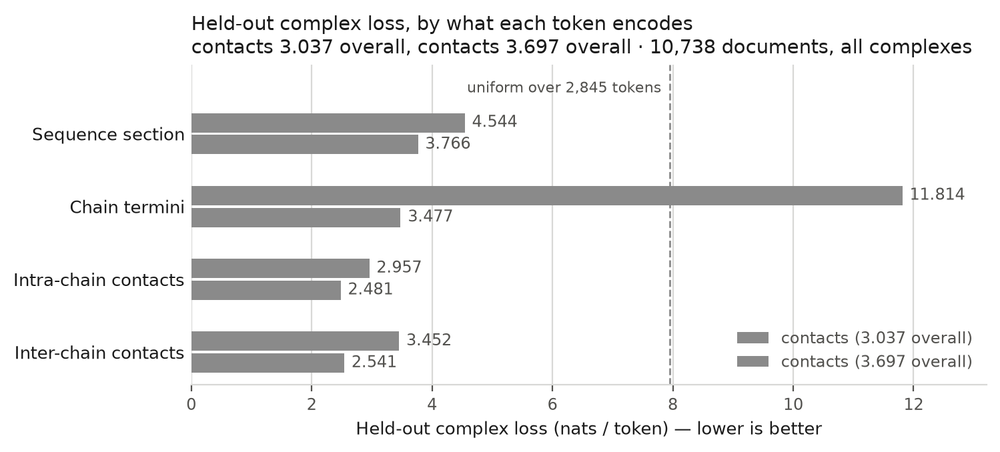

---
marinfold_experiment:
  issue: 343
  title: 'exp: train 1.5B on the exp277 corpus plus the predicted-complex corpus'
  kind: models
  branch: main
---

# exp: train 1.5B on the exp277 corpus plus the predicted-complex corpus

**Issue:** [#343](https://github.com/Open-Athena/MarinFold/issues/343) · **Kind:** `models` · **Branch:** `main`

## Question

Does adding the [#294](https://github.com/Open-Athena/MarinFold/issues/294) predicted-complex corpus to the exp277 native + ProteinMPNN training mixture change contacts-v1 monomer contact accuracy, and does the resulting model actually learn multi-chain complexes?

## Hypothesis

The complex corpus is 11.15 B tokens against exp277's 248.58 B — **4.3% of the mixture**. So:

- **Monomer accuracy is a tie.** eval-val R-precision lands within the predeclared 0.005 threshold of exp277's 0.55375. A 4.3% mixture change, spent on a document type the eval does not contain, should not move a monomer benchmark either way. A loss of more than 0.005 would be the interesting result, not the expected one.
- **Complex modelling is not a tie.** Held-out complex LM loss drops far below what exp277's checkpoint achieves on the same documents. exp277 has never seen a multi-chain document, so it must pay for the shared 2000-index ring, the interleaved chain runs, and inter-chain contacts at any index distance. This is the measurement the experiment exists for.
- Designed-protein (eval-denovo) accuracy is the one monomer number with a plausible mechanism for moving: interface contacts are, geometrically, contacts between two pieces of chain that sequence separation does not explain, which is also what designed folds stress. No direction is predeclared.

## Background

- [#277](https://github.com/Open-Athena/MarinFold/issues/277) trained the current default, `contacts-v1-exp277-m2-p06-full-epoch-1.5B` — one complete epoch over 232,090,905 native + MPNN-redesigned documents / 248,583,762,834 raw tokens / 34,092,146 packed examples, 266,345 steps, from scratch on exp232's m2-p06 settings. R-precision 0.62009 legacy 554 / 0.55375 eval-val / 0.69582 eval-denovo.
- [#294](https://github.com/Open-Athena/MarinFold/issues/294) built and published the predicted-complex corpus: 3,410,738 documents / 11,151,472,024 tokens of protein–protein complexes, 261,833,754 interface contacts, 611,656 heterodimers + 2,799,082 homodimers, decontaminated against all 577 eval2 units on every subunit. Two arms: `afcdb` (2,982,517 predicted dimers) and `pinder` (428,221 experimental heterodimers).
- The multi-chain document format is [#222](https://github.com/Open-Athena/MarinFold/issues/222)'s and adds **no new tokens** — verified here, not assumed (see Notes).
- No MarinFold model has ever been trained on a multi-chain document. This is the first.

## Approach

**Match exp277 in every training setting.** Scratch init, Qwen3 1.5B (`MODEL_CONFIG` from exp232's `training_contract.py`), seq len 8192, global batch 128, Adam LR 1e-3 / weight decay 0.2, WSD linear warmup 10% / decay 20% / min-LR ratio 0.1, packed documents with blocked cross-document attention, scheduled amino-acid order augmentation, `MODEL_SEED=0`, `DATA_SEED=0`, `BlockShuffleConfig(256, 512, feistel)`. 16 nodes x 8 H100 on `cw-us-east-02a` at **batch priority**, which is where the four exp277 caches already live.

**Corpus = exp277's four caches, unchanged, plus the complex corpus.** One epoch, every packed example visited exactly once, one fresh global shuffle over the concatenation, no mixture weighting and no source cycling — exp277's `epoch_data.OneEpochDataConfig`, reused. The step count is measured with the trainer's own packer before launch and pinned, as exp277 did; it will be about 280,000.

**The complex corpus is taken at its `manifest_natural` weighting**, i.e. every document once. `manifest_balanced` exists because PINDER averages 18.7 structures per interface cluster, but applying it would mean weighted sampling, which is exactly the setting exp277 does not use. Declining it is the matched-settings choice, not a claim that it is worse.

**One shard is held out.** `shard-00170-of-00171` (10,738 documents, 0.31% of the corpus) becomes a second validation cache. Without it this experiment has no measurement of the thing it is testing — the monomer eval sets contain no complexes, so a complex-blind run and a complex-fluent one would be indistinguishable. Training uses shards 00000–00169.

Stages, one `launch.py` phase each:

- `stage` — mirror the 171 published shards HF bucket -> `s3://marin-us-east-02a/MarinFold/exp<N>.../documents/`, from an in-region CoreWeave CPU pod. The workstation uplink is ~2 MB/s, so 19.6 GB must not pass through it.
- `prepare` — tokenize the staged shards with `eczech/contacts-v1-tokenizer-5d68a24a899f` under exp277's per-record validation, and independently audit a smoke cache against fresh tokenization. Verify the four exp277 caches by ledger and pinned counts; build nothing that already exists.
- `audit` — count packed examples per corpus with `GreedyPrepackedDataset`, pin `EPOCH_PACKED_EXAMPLES` and the step count.
- `train-smoke` — ten optimizer updates on the full production caches, separate run identity.
- `train` — production.

**Evaluation.** Two halves, and the second is not optional:

1. *Monomers, for comparability.* The fixed exp82 rollout-and-resample recipe at exp277's settings, on legacy 554 + eval-val + eval-denovo, paired per-protein against exp277 with 10,000-resample protein bootstrap intervals. **eval-test stays unread.**
2. *Complexes, for the actual question.* LM loss on the held-out complex shard for this checkpoint and, as the control, for the exp277 default — same documents, same tokenizer, same packing. Reported per arm (`afcdb` / `pinder`) and split by whether a contact crosses a chain boundary, because a model can score well on a complex document by predicting its intra-chain contacts alone.

## Success criteria

- A healthy production run to the pinned step count, with a permanent native checkpoint and an HF export carrying its tokenizer.
- **Monomer:** eval-val R-precision within 0.005 of exp277 (a tie, the predeclared expectation), with paired bootstrap intervals on all three sets. A regression beyond 0.005 is a reportable cost of the mixture change, not a failure of the run.
- **Complex:** held-out complex LM loss materially below exp277's on the same documents, with the inter-chain split reported. This is what decides whether the corpus taught anything.
- Full identity trail: iris job ids, W&B run, commit SHA, checkpoint paths, `history/runs/` entry, per-input eval timings.

## Results

### Corpus preparation

**The complex corpus fits the model's vocabulary.** The corpus publishes a
2,848-token tokenizer beside the data; the 1.5B model has 2,845 embedding rows.
The three extra ids are `<contacts-v1.sequence_only>` (2845), `<retract>` (2846)
and `<contacts-v1.backtracking>` (2847) — appended by other document structures
and unused here. Below 2845 the two vocabularies are *identical*, so tokenizing
with the model's own tokenizer is not an approximation. On shard 00000, all
20,000 documents re-encode to exactly their recorded `num_tokens`, reach token id
2142 at most, and satisfy the contacts-v1 boundary contract. Recorded in
[`data/tokenizer_contract.csv`](data/tokenizer_contract.csv); reproduce with
`verify_tokenizer_contract.py --shard <shard>`. That sample is evidence, not the
guarantee: `prepare.py` applies the same per-record check to every document of
every shard while the caches are built, so a document reaching an out-of-contract
id fails the build rather than indexing past the embedding table.

**Truncation is statement-granular, which the issue's note had slightly wrong.**
The published corpus flags 2.4% of documents `truncated`, and those land at
8190–8192 tokens rather than exactly on the cap — #294 drops whole three-token
contact statements. Only the documents landing exactly on 8192 lose their
appended `<eos>` to the packer's clip: 178 of 20,000 on shard 00000, about 0.9%
of the corpus rather than the 2.4% implied by the `truncated` flag. No document
exceeds the cap.

**Staging: 19.6 GB in about three minutes.** `/bizon/exp343-stage-a01` mirrored
all 171 published shards from the public HF bucket into
`s3://marin-us-east-02a/MarinFold/exp343_models_complex_corpus_training/documents/`
on one in-region CoreWeave CPU pod, splitting the held-out shard out on the way
in. The staged footers reconcile exactly with the published corpus:
**3,410,738 documents = 3,400,000 train across 170 shards + 10,738 validation in
shard 00170**, matching the counts pinned in `config.py` before the job ran. Per
shard size, row count and SHA256 are in `documents/stage-manifest.json`.

All four exp277 token caches were confirmed present and complete in
`marin-us-east-02a` before any of this started, so nothing is re-tokenized: the
native AFDB/ESM caches from exp232 (`2026.08.14`) and the MPNN AFDB/ESM caches
from exp277 (`2026.09.09.1`).

**Tokenization smoke: exactly reproducible.** `/bizon/exp343-prepare-smoke-a01`
built both caches from one shard each and compared **every row against
independent fresh tokenization** — 20,000 training rows and all 10,738 validation
rows matched exactly.

### The epoch, measured with the trainer's own packer

`/bizon/exp343-audit-a01` packed every cache exactly as training will
(`GreedyPrepackedDataset`, 8192, 64 segments, left slicing). **All four exp277
corpora reproduced exp277's own audit to the example** — 616,320 + 9,554,637 +
5,010,642 + 18,910,547 = 34,092,146 — which is the strongest available evidence
that the adopted caches are the ones exp277 trained on and that the packer has not
changed under us.

| corpus | documents | raw tokens | packed examples | clipped |
| --- | ---: | ---: | ---: | ---: |
| native-afdb | 3,963,003 | 4,432,940,838 | 616,320 | 90 |
| native-esm | 65,553,178 | 70,042,923,165 | 9,554,637 | 0 |
| mpnn-afdb | 31,702,680 | 35,352,543,972 | 5,010,642 | 770 |
| mpnn-esm | 130,872,044 | 138,755,354,859 | 18,910,547 | 2 |
| **complex** | **3,400,000** | **11,120,116,172** | **1,767,628** | **27,917** |
| total | 235,490,905 | 259,703,879,006 | **35,859,774** | 28,779 |
| *complex-validation (held out)* | *10,738* | *34,766,590* | *5,513* | *75* |

So **280,155 optimizer steps**, against exp277's 266,345: **+13,810 steps,
+5.2%**. The complex corpus is 4.3% of raw tokens and 4.9% of packed examples —
it packs slightly less efficiently because its documents are longer (3,270 tokens
mean against the mixture's 1,103). The 27,917 clipped documents are the ones
sitting exactly on the 8192 cap, losing their appended `<eos>`: 0.82% of the
corpus, in line with the 0.9% measured on shard 00000.

Counts are committed in [`data/epoch_corpus_counts.csv`](data/epoch_corpus_counts.csv),
and `train.py` refuses to launch unless the trainer's own count of the
concatenated corpus equals the pinned 35,859,774.

### The inter-chain split

`complex_sections.py` derives each document's chain layout from its own
`<n-term>`/`<c-term>` statements and labels every token as header, sequence,
terminus, intra-chain contact or inter-chain contact. Verified against the
published metadata — which comes from the source structures, not the document
text — on all 20,000 documents of shard 00000: `num_chains`, per-chain lengths,
total contacts and `contacts_emitted_inter_chain` **all match, 20,000/20,000**,
with no unresolved contacts. Its 1,547,229 of 12,344,634 inter-chain contacts is
**12.5%**, against the corpus's own reported 12.4%. See
[`data/sections_check.csv`](data/sections_check.csv); reproduce with
`verify_sections.py --shard <shard>`.

One thing this caught: **the terminus statements are interleaved into the shuffled
sequence section**, not placed in the statements section as the spec's wording
suggests. Labelling them only in the statements section reported zero terminus
tokens and silently charged their loss to `sequence`.

### Complex-loss scorer, validated on the control before training started

`/bizon/exp343-complex-eval-smoke-a03` scored exp277 on 32 held-out complex
documents on one H100. The rope and tokenizer contracts held on load
(`rope_theta=500000`, `rope_type=llama3`, vocab 2,845, 1,471,374,336 parameters),
so the #163 silent-rope failure is excluded. 98,005 scored positions in 3.5 s,
which puts the full 10,738-document control at about 20 minutes on one GPU.

Two bugs this shook out before they could reach a result: transformers 4.53 in the
pinned image accepts an unknown `dtype=` kwarg, parks it on the config as a
`torch.dtype`, and then dies JSON-serializing its own log line; and the dispatcher
was catching every child failure and exiting 0, so a driver could report success
for a run that produced nothing.

**Production tokenization reconciles to the published token count with no
slack.** `/bizon/exp343-prepare-a01` built the training cache at **3,400,000
documents / 11,120,116,172 tokens** and the validation cache at **10,738
documents / 34,766,590 tokens**. Each cache token total is its documents' tokens
plus one appended `<eos>` per document, so subtracting the documents gives
11,116,716,172 + 34,755,852 = **11,151,472,024** — the published corpus's
`corpus_stats.json` token count, to the token.

### The control: exp277 on the held-out complexes

`/bizon/exp343-complex-eval-a01` scored the exp277 default on all **10,738**
held-out complex documents (34,755,777 positions) in 12.4 minutes on one H100.
This is the number exp343 has to beat, and it is banked before exp343 exists.

| group | documents | nll/token | sequence | intra-chain | inter-chain | terminus |
| --- | ---: | ---: | ---: | ---: | ---: | ---: |
| **all** | 10,738 | **3.6970** | 4.5435 | **2.9573** | **3.4518** | **11.8137** |
| `afcdb` | 9,383 | 3.6838 | 4.5441 | 2.9404 | 3.3893 | 11.8125 |
| `pinder` | 1,355 | 3.8307 | 4.5374 | 3.1194 | 4.6512 | 11.8220 |
| heterodimer | 1,973 | 3.8158 | 4.5391 | 3.0909 | 4.3286 | 11.7933 |
| homodimer | 8,765 | 3.6772 | 4.5443 | 2.9343 | 3.3627 | 11.8183 |
| tier A | 5,500 | 3.6576 | 4.5381 | 2.9448 | 3.5016 | 11.8711 |
| tier B | 3,883 | 3.7287 | 4.5533 | 2.9316 | 3.2380 | 11.7295 |

Three things stand out, and all three are hypotheses about what exp343 should
fix:

**The split was worth building.** exp277 pays **2.9573** nats on intra-chain
contacts and **3.4518** on inter-chain — it handles the contacts that look like
monomer contacts and is 0.50 nats worse on the ones that cross a chain boundary.
A single fused number would have averaged that away, and the 12.5% inter-chain
token share means the fused number is dominated by the part exp277 already knows.

**The terminus loss is the format signature: 11.81 nats.** Uniform over the whole
2,845-token vocabulary is 7.95, so exp277 is not merely uncertain here, it is
*confidently wrong*. That is what format-blindness looks like — a monomer model
has only ever seen one `<n-term>`/`<c-term>` pair per document, and a complex has
*k* of them at unpredictable ring positions. Read with one caveat: this role
bundles the marker token with the position token that follows it, and a 2,000-way
ring position is about 7.6 nats under uniform on its own, so the 11.81 is an
average over a cheap token and an expensive one. Splitting them would sharpen the
claim; the direction does not depend on it.

**Homodimers are much easier than heterodimers** — 3.3627 against 4.3286 on
inter-chain contacts. A homodimer interface is between two copies of one
sequence, so intra-chain knowledge partly transfers; a heterodimer interface has
no such shortcut. PINDER, which is experimental crystallised fragments rather than
predicted models, is hardest of all at 4.6512.

Committed under [`data/complex_loss/`](data/complex_loss/) with its provenance and
per-input timing.

### The scorer loads exp343's own export format

`/bizon/exp343-complex-eval-smoke-a04` ran the scorer against **exp343's own**
smoke export (`hf/step-9`), not exp277's. It loaded with
`rope_theta=500000 rope_type=llama3 vocab=2845 params=1471374336` — identical to
exp277's — so this run's export pipeline writes rope and tokenizer metadata the
scorer can read, and the #163 silent-rope failure is excluded for the *production*
checkpoint's format and not just the baseline's. Its loss (6.898 nats/token) is
meaningless as a result: ten updates from scratch. It is a load check.

It is also a cross-implementation agreement check. Levanter reported
`eval/input/validation-complex/loss` = 6.91106 for that same checkpoint over two
packed batches; this scorer, on 32 unpacked documents, reports 6.898. Different
samples, independent implementations, same answer to three significant figures.

### Training smoke

`/bizon/exp343-train-smoke-a01` (one node, 8 H100, batch priority) ran ten
updates over the **full production caches** and succeeded. Final train loss
7.46915 from scratch, 17.5% MFU, 101,421 tokens/s on 8 GPUs, and the HF export
landed at `runs/contacts-v1-exp343-m2-p06-complex-1.5B-smoke/hf/step-9`.

The two things it was there to prove both hold:

- **Both validation sets are wired and reported separately** —
  `eval/input/validation/*` (monomer, 6.92887) and
  `eval/input/validation-complex/*` (held-out complexes, 6.91106). A single
  fused number would have made the complex half of this experiment unmeasurable.
- **The trainer's own count of the concatenated corpus equals the pinned
  35,859,774.** `OneEpochDataConfig` raises on any disagreement, so the smoke
  completing at all is that assertion passing.

[Smoke W&B](https://wandb.ai/open-athena/MarinFold/runs/contacts-v1-exp343-m2-p06-complex-1.5B-smoke).

### Production

Submitted 2026-09-28 21:41 UTC as
[`/bizon/exp343-train-a01`](https://iris.oa.dev/#/job/%2Fbizon%2Fexp343-train-a01),
16 nodes x 8 H100 on `cw-us-east-02a` at batch priority, 280,155 steps, run
[`contacts-v1-exp343-m2-p06-complex-1.5B`](https://wandb.ai/open-athena/MarinFold/runs/contacts-v1-exp343-m2-p06-complex-1.5B).
At exp277's observed 0.858 s/step this is about 67 hours of compute plus
validation and checkpoint overhead. `cw-us-east-02a` had 22 of 256 H100 free at
submission, so the gang queues behind interactive holds first; batch priority is
the standing rule for CoreWeave GPU work and queue time is not a reason to break
it.

The driver dispatched its gang immediately and all 16 tasks sit
`building / SchedulingGated` on one Kueue workload
(`iris-pg-7ab1faf9080d0602-0`), which is what a correctly formed gang waiting on
capacity looks like — it admits as a unit, not task by task.

**The gang is deliberately not resliced smaller.** Gang size is placement, not
configuration: global batch, step count, seeds and shuffle are fixed, so only
`per_device_parallelism` and wall clock change. But the arithmetic does not
favour waiting less: 8 nodes needs 64 free (still more than were available) and
doubles the run to ~134 h, and 2 nodes would fit inside current capacity while
taking about **22 days**. 16 nodes is both the matched configuration and the
fastest finish once admitted, and the fleet does swing — exp277 launched into 248
free H100 on this same cluster.

**RNO2A is a live option, and the two reasons to dismiss it both turned out to be
wrong.**

*There is nothing to move.* `cw-rno2a.yaml` sets `MARIN_PREFIX` to
`s3://marin-us-east-02a/...` itself, with the comment "everything lives in
marin-us-east-02a; LOTA caches reads locally". CoreWeave has **one** shared
bucket, so placing on RNO2A copies no data and triggers no cross-region rule. The
read volume is negligible anyway: 260 GB spread over a 67-hour compute-bound run
is about 1.1 MB/s.

*8-node gangs work there.* The root `AGENTS.md` records that on RNO2A "1/2/4-node
gangs bootstrap and train; **8-node fails** — the JAX multi-host coordination
bootstrap aborts". That is **stale as of 2026-09-28**.
`/bizon/exp343-train-smoke-a02` ran a full 8-node / 64-H100 gang there to
completion: ten updates, train loss 7.61668, 86.93 examples/s, 712,117 tokens/s,
15.4% MFU, both validation sets reported
([W&B](https://wandb.ai/open-athena/MarinFold/runs/contacts-v1-exp343-m2-p06-complex-1.5B-smoke-n8-rno2a)).
Verified against W&B rather than the job's exit status — a gRPC teardown trace in
the logs made "succeeded" worth not taking at face value. Scaling is 88% of the
1-node rate.

The cost is wall clock, not correctness: 1.47 s/step at 8 nodes against exp277's
0.858 s/step at 16, so **114 h against 67 h** for the same 280,155 steps. The two
placements cannot run at once — they would write the same checkpoint path under
the same run id — so this is a choice, not a hedge.

### Production run history

The run spans two Iris jobs, and the break was an operator error worth recording
rather than smoothing over.

`/bizon/exp343-train-a01` was submitted 2026-09-28 21:41 UTC and sat gang-queued
while `cw-us-east-02a` ran at 0-22 free H100. The queue drained overnight, the
gang admitted, and it trained for **11.8 hours to step 39,475** — train loss
2.9115, monomer validation 3.1375, and a held-out complex validation loss of
**3.3208**, already below exp277's 3.6970 control.

On 2026-09-29 at 09:33 UTC it was **cancelled by mistake**. The intent was to
free the queue slot before placing on RNO2A; the decision was made from a monitor
reading of `tasks=0/16` that was ten hours stale, and the job's actual progress
was never checked before acting. Scheduler state is not evidence about whether a
job is doing work — W&B is, and it was one query away.

Cost: **108 steps, about 90 seconds of compute.** Levanter writes its rolling
15-minute checkpoints to `temporary_base_path` — a *separate* `tmp/ttl=14d/`
prefix — and only the `keep` snapshots to `base_path`. Listing `base_path` alone
shows just `step-28015` and makes the loss look like 4.7 hours; `step-39367` was
sitting in the temp path, complete at 17.66 GB, written at 13:32:19 UTC, one
minute before the cancellation. The resumed job searched both locations and
restored the newer one.

That temp checkpoint is also *deletable*: `delete_old_temp_checkpoints: true`
means the next run removes it once it writes its own. It was copied server-side
(8.7 s, byte-for-byte verified) to
`{PREFIX}/rescued/step-39367/` before the resumed job could reach that point.

Nothing else was damaged; the corpus, caches and control are untouched.

`/bizon/exp343-train-a02` resumed from `step-28015` at 09:35 UTC, 16 nodes on
`cw-us-east-02a` (which by then had 248 free H100), same run id and checkpoint
path, so the W&B run and the checkpoint trail continue unbroken.

### Training completed

`/bizon/exp343-train-a03` finished the epoch at **step 280,154** on 2026-10-04,
8 nodes x 8 H100 on `cw-rno2a`. The run spans three Iris jobs (`a01` cancelled by
mistake, `a02` killed by the `max_task_failures=0` default, `a03` to completion)
and **lost 371 steps in total** across both recoveries — 108 and 263 — because a
rolling checkpoint always survived in the temp path.

The WSD cooldown over the final 20% is where the result was made:

| | step 224,084 | **final, 280,154** | change |
| --- | ---: | ---: | ---: |
| monomer validation | 3.0788 | **2.9934** | −0.0855 |
| held-out complex validation | 3.1805 | **3.0366** | −0.1439 |

Both are best-at-final, so checkpoint selection is not a question. Against
exp277's final monomer validation of 2.98274, exp343 is **0.011 nats worse** on
monomers and **0.660 better** on complexes.

### Monomer contact prediction: a real regression

`/bizon/exp343-eval-v2-01-r2`, 670 units under the fixed exp82 rollout recipe,
worker byte-identical to the PR #244 scorer. The run was clean: **67,000 of
67,000 rollouts usable, zero unfinished, zero affected units**, 556 unique stems.
exp277 is *not* re-scored — its committed per-protein results are the comparison
input, so there is one exp277 number rather than two sampling draws.

| subset | range | exp343 | exp277 | delta | 95% CI | n |
| --- | --- | ---: | ---: | ---: | --- | ---: |
| legacy 554 | all | 0.60424 | 0.62009 | **−0.01585** | [−0.02289, −0.00902] | 554 |
| legacy 554 | long | 0.56276 | 0.57704 | −0.01427 | [−0.02313, −0.00533] | 553 |
| **eval-val** | **all** | **0.52739** | **0.55374** | **−0.02635** | **[−0.03921, −0.01477]** | 97 |
| eval-val | long | 0.50990 | 0.53801 | −0.02811 | [−0.04283, −0.01493] | 97 |
| eval-denovo | all | 0.68529 | 0.69582 | −0.01052 | [−0.03468, +0.01065] | 19 |
| eval-denovo | long | 0.64400 | 0.67603 | −0.03202 | [−0.06777, −0.00303] | 19 |

**The predeclared hypothesis is falsified.** eval-val was predicted to land within
0.005 of exp277; it is −0.0269, five times that threshold, with a paired
protein-bootstrap interval excluding zero. Five of the six intervals exclude
zero; only eval-denovo *all* is ambiguous, and that is the n=19 set.

For scale, −0.027 is larger than the entire +0.015 gain exp277 made over exp232
on legacy 554, and roughly twelve times #204's 0.0023 noise floor.

Intervals are 10,000-resample protein bootstraps (seed 343) over per-protein
differences; they describe variation across evaluation proteins and say nothing
about training-seed variation. eval-test was not read.

**Repeated-rollout variation is measured, not assumed.** The evaluation was run
twice end to end — `v2-01` and `v2-02`, 67,000 freshly sampled rollouts each.
The two draws agree to **5.3e-4** on eval-val (0.526859 vs 0.527393) and
1.4e-4 on legacy 554. The reported effect of −0.026 is about **50x** that, so
sampling noise is not a candidate explanation. `v2-02` is the canonical run and
the committed artifacts are its; `v2-01` differed only in the checkpoint label
and the absence of per-document timings.

### Complexes: the corpus taught what it was built to teach

`/bizon/exp343-complex-eval-a02`, all 10,738 held-out documents, 34,755,777
scored positions, 12.4 minutes on one H100.

| group | exp343 | exp277 | delta |
| --- | ---: | ---: | ---: |
| **all** | **3.0369** | **3.6970** | **−0.6601** |
| `afcdb` (predicted) | 3.0397 | 3.6838 | −0.6441 |
| `pinder` (experimental) | 3.0085 | 3.8307 | −0.8222 |
| heterodimer | 3.1082 | 3.8158 | −0.7076 |
| homodimer | 3.0250 | 3.6772 | −0.6522 |

Split by what each token encodes — which is what the holdout and the labeller
were built for:

| role | exp343 | exp277 | delta | tokens |
| --- | ---: | ---: | ---: | ---: |
| sequence | 3.7663 | 4.5435 | −0.7773 | 14,912,148 |
| **chain termini** | **3.4770** | **11.8137** | **−8.3367** | 85,904 |
| intra-chain contacts | 2.4814 | 2.9573 | −0.4759 | 17,260,659 |
| **inter-chain contacts** | **2.5415** | **3.4518** | **−0.9104** | 2,454,189 |

**Format-blindness is gone.** exp277 paid 11.81 nats on terminus statements —
above the 7.95 of a uniform distribution over the vocabulary, meaning it was
confidently wrong, not merely uncertain. exp343 pays 3.48.

**The interface gap essentially closed.** exp277 was 0.495 nats worse on
inter-chain than intra-chain contacts; exp343 is **0.060** worse. It now predicts
a contact across a chain boundary nearly as well as one within a chain, which is
the specific capability the corpus exists to teach.

The complex evaluation was run three times, and being a deterministic forward
pass it **reproduces to 3e-11** (3.036928785 every time) — so the worker refactor
that added per-document timing changed no measurement.

Checkpoints are identified by the AGENTS.md `<wandb-run-name>-step-<N>` form
throughout both pipelines, so every output prefix, aggregate row and
`model_nickname` traces back to the exact run.

Committed under [`data/eval_rollout_v2/`](data/eval_rollout_v2/) and
[`data/complex_loss/`](data/complex_loss/) with provenance and **one timing row
per scored document** (10,738 per checkpoint, carrying `n_residues` and the exact
contacts-v1 candidate-pair count).

## Conclusion

**Adding the #294 predicted-complex corpus to exp277's mixture is a trade, not a
free win.** At 4.3% of training tokens it bought a 0.660-nat improvement on
held-out complexes — closing an 8.3-nat format gap on chain termini and shrinking
the inter-chain/intra-chain penalty from 0.495 to 0.060 nats — and cost
**0.0269 R-precision on natural monomers** (eval-val, 95% CI [−0.0398, −0.0155]).

The monomer cost is the answer to the question the issue asked, and it is the
opposite of what was predeclared. A reader deciding whether to make this the
default mixture is choosing between monomer contact accuracy and complex
modelling; this experiment prices that choice but does not make it.

**One confound is live and limits the causal claim.** exp343 saw 11.15 B tokens
exp277 did not, and this is one seed per arm. Nothing here separates "complex
documents hurt monomer prediction" from "this much extra data of any kind, at
this budget, hurts monomer prediction". A token-matched control — exp277's
corpus subsampled to the same budget, or the complex corpus swapped for an equal
mass of native documents — is the experiment that would settle it, and is the
natural follow-up.

A second, narrower caveat: the monomer eval sets contain no complexes, so the two
halves of this result are measured on disjoint data and cannot be traded off
inside a single number.

