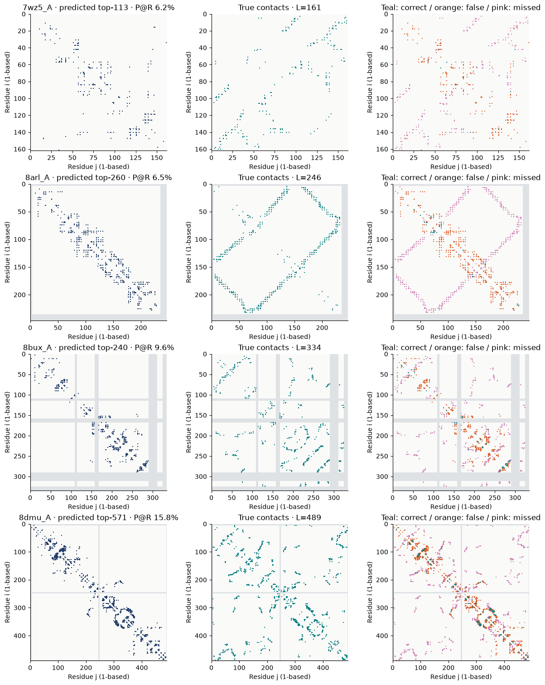
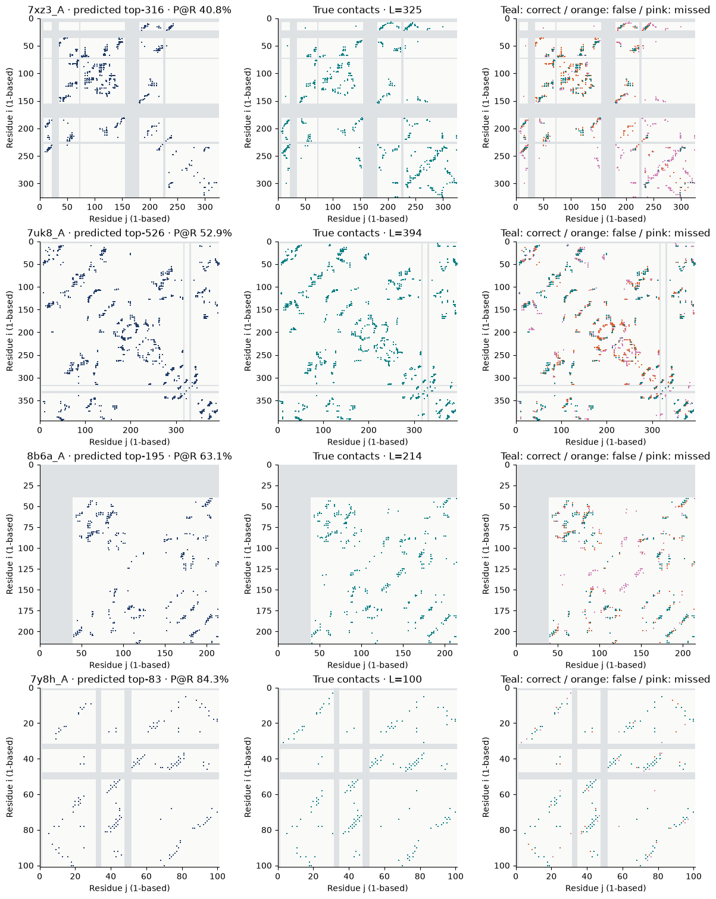
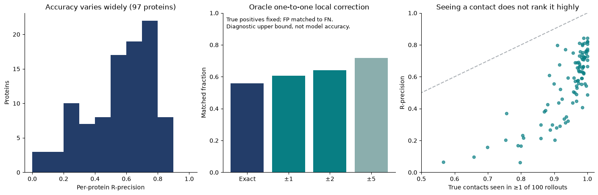
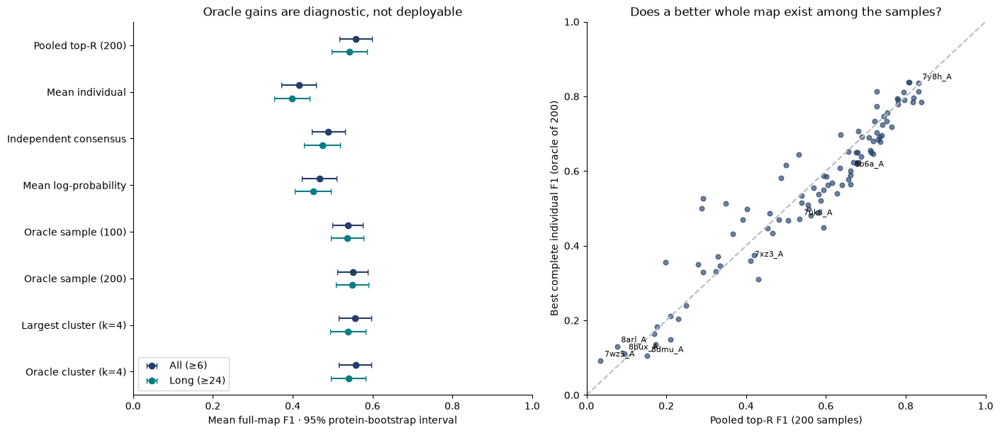
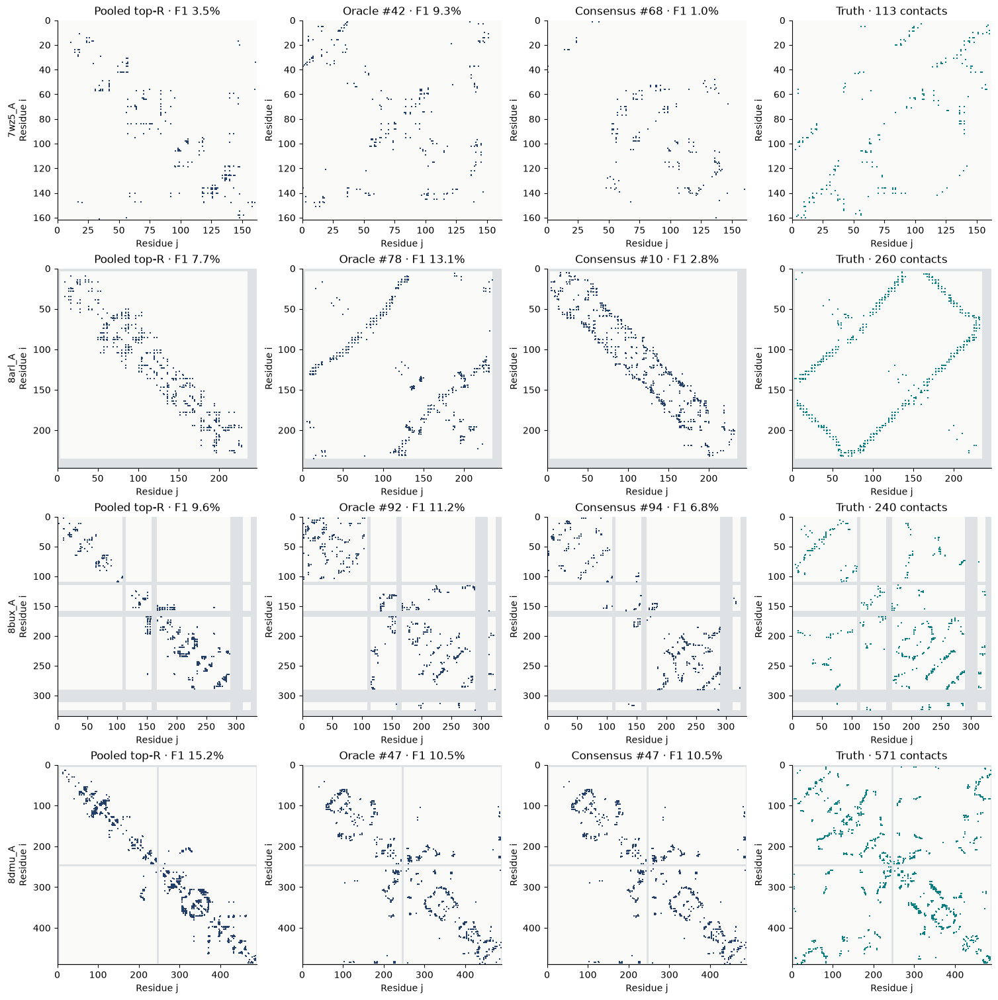
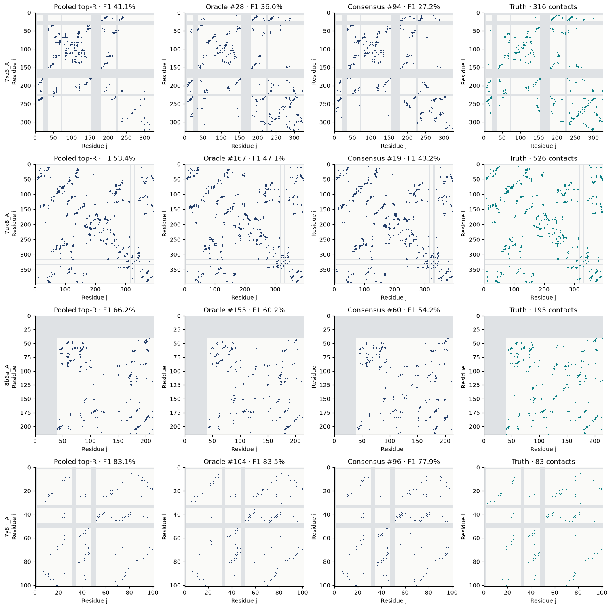

---
marinfold_experiment:
  issue: 345
  title: 'exp: qualitative contact-map errors on eval-val'
  kind: evals
  branch: main
---

# exp: qualitative contact-map errors on eval-val

**Issue:** [#345](https://github.com/Open-Athena/MarinFold/issues/345) · **Kind:** evals

[Open the self-contained HTML report](report.html), or download it from the
[public artifact directory](https://huggingface.co/buckets/open-athena/MarinFold/tree/data/exp345-qualitative-contact-map-errors/v2).
The HTML works offline in a modern browser. It contains an annotated inspector,
vote-frequency and error views, synchronized drag-to-zoom, per-pair hover details,
contact downloads, and side-by-side prediction/truth cards for **all 97 eval-val
proteins**. The gallery is sortable and searchable.

## Question

What qualitative errors distinguish MarinFold's predictions from the correct
contact maps, and which errors plausibly explain its limited accuracy?

## Hypothesis

Missing or misplaced long-range contact features, diffuse ensemble votes, and
local residue-register shifts may contribute differently. Aggregate precision
alone cannot distinguish them.

## Approach

Reuse exp277's saved epoch-2 evaluation: W&B run
[`contacts-v1-exp277-m2-p06-full-epoch2-from213072-1.5B`](https://wandb.ai/open-athena/MarinFold/runs/contacts-v1-exp277-m2-p06-full-epoch2-from213072-1.5B),
**step 479417**. The score source is
`s3://marin-us-east-02a/MarinFold/exp277_models_single_mpnn_pilot/evals/rollout-v2/2026-09-13/v2-02/dense_scores/exp277_full_epoch2_from213072_step479417/`.
The evaluation completed on 2026-09-19. This analysis uses the latest documented
saved exp277 checkpoint; it does not assume every MarinFold checkpoint behaves
identically.

The exp82 sampling recipe used 100 fresh document realizations per protein,
temperature 1.0, top-p 0.95, disabled top-k, and the 6L+128 token budget subject
to the model context limit. All eval-val rollouts terminated. Only their final
live contacts vote. Counts are marginal occurrence frequencies, not calibrated
probabilities or a single sampled structure.

Truth comes from exp245's frozen `gt_universe_scored.jsonl`, filtered to its
97 natural eval-val proteins. These are **pyconfind side-chain contacts with
degree ≥0.001 and sequence separation ≥6**, not Cα/Cβ distance-threshold maps.
Both endpoints must be resolved. Coordinates are positions in the input
sequence; report labels are one-based. Unresolved residues are gray bands,
never false negatives or true negatives. Both matrix halves are displayed but
unordered pairs are counted once.

The top-R map has exactly as many predicted pairs as the truth, making its
precision equal to recall. It uses the canonical stable vote-count ranking.
R is an evaluation oracle, not information available at deployment. Separately
compute top-L/5 precision, range-specific metrics, true-contact vote support,
and nearest-contact distances. All reported aggregate means weight proteins
equally.

Two deliberately different local-error diagnostics prevent an appealing but
misleading conclusion. Many-to-one proximity asks whether any true contact is
within ±d positions at both endpoints. The stricter oracle keeps exact true
positives, then maximally matches false positives to still-missed true contacts
one-to-one within that radius. It does not permit reusing an already-recovered
contact. Neither diagnostic produces a usable predictor.

## Success criteria and validation

- All 97 eval-val proteins are present, with source matrix SHA256 digests,
  truth and membership digests, the source scoring table, and sampling settings
  in `data/provenance.json`.
- All **1,940 canonical rows** (97 proteins × four ranges × five metrics)
  reproduce exp277's source scores and counts to absolute tolerance 1e−12.
- Browser-side top-R selections independently reproduce all 97 canonical
  per-protein precisions. All 194 gallery canvases render at desktop and mobile
  sizes; controls, filtering, sorting, downloads and layout pass browser checks.
- Independent fixtures distinguish nearby duplicate predictions from distinct
  shift-correctable contacts, guarding against many-to-one inflation.
- The original atlas reuses saved inference. The follow-up below runs fresh
  inference on eval-val only and records every protein’s timings. Neither reads
  eval-test or creates a new W&B run.

## Results

### Two qualitatively different regimes

The mean all-range R-precision is **0.55750**, long-range R-precision **0.53935**,
and top-L/5 precision **0.81179**. The strongest handful of contacts are much
better than the complete size-matched map; top-L/5 also has much lower coverage.
Individual R-precision ranges from **0.06195 to 0.84337**.

In the lowest-accuracy quartile (25 proteins selected post hoc by precision),
long-range contacts make up **69.3% of truth but only 41.2% of predictions**.
Across all 97 proteins, those fractions are 67.6% and 59.0%. Global-top-R recall
is 64.6% for short-range, 59.8% for medium-range, and 52.4% for long-range truth
contacts. These range recalls use the global contact budget; they are distinct
from the canonical per-range R-precision metric.

The severe failures visibly put dense local contact clusters near the diagonal
where truth contains extended off-diagonal traces. Better cases often recover
the broad pattern but add and omit detailed contacts within those regions.
The illustrative cases below were chosen after map inspection, not as a random
sample; the all-protein atlas and aggregate statistics provide the context.

| Protein | Exact P@R | One-to-one ±2 oracle | Qualitative observation |
|---|---:|---:|---|
| 7wz5_A, croaker IFNi | 6.2% | 15.9% | Missing long-range traces; 91% long-range truth versus 28% predictions |
| 8arl_A, Plasmodium TRAg domain | 6.5% | 11.2% | Diamond-like off-diagonal truth replaced by a near-diagonal band |
| 8bux_A, human MiniBAR Rab-binding domain | 9.6% | 19.2% | N-terminal arc and C-terminal patterns absent or displaced |
| 8dmu_A, Drosophila macrodomain | 15.8% | 27.3% | Broad loss of distant contacts, including between sequence ends |
| 7xz3_A, CRISPR-associated Csh2 | 40.8% | 52.5% | Some traces correct; extensive C-terminal omissions and local clutter |
| 7uk8_A, E. coli YgiC | 52.9% | 70.5% | Recognizable broad map with substantial detailed-contact errors |
| 8b6a_A, Bacteroides BfrB | 63.1% | 73.3% | Several features align, but local overpopulation and missing traces remain |
| 7y8h_A, sDscam FNIII1 | 84.3% | 88.0% | Most major traces and detailed contacts recovered |

### Small shifts explain only part of the gap

On average, **60.8% of false positives** are within two positions at both
endpoints of some true contact. Many-to-one proximity would therefore call
**80.7%** of the selected predictions near-correct, versus 14.6% expected for a
uniformly chosen candidate pair. That is not a valid replacement for accuracy:
many predicted contacts can cluster around a true contact already recovered.

Fixing exact matches and enforcing one-to-one matching produces a much smaller
change:

| Allowed local displacement | Mean matched fraction |
|---|---:|
| Exact | 55.75% |
| ±1 at each endpoint | 60.52% |
| ±2 at each endpoint | 64.01% |
| ±5 at each endpoint | 71.83% |

The ±2 oracle gains **8.26 percentage points**, equivalent to about 18.7% of
the mean exact-error fraction. Even this truth-informed procedure leaves about
36% unmatched. For 8b6a_A, many-to-one ±2 proximity is 95.4%, but one-to-one
matching is only 73.3%. Visual resemblance is appreciably better than recovery
of the full set of specific contacts.

### Correct contacts are usually sampled, but often weakly

An average **93.9% of true contacts** occur at least once in the 100 rollouts;
**29.3% receive fewer than ten votes**. Even among contacts missed by top-R,
89.0% appear somewhere in the samples. The mean per-protein median vote count
is 62.0 for true positives, 38.7 for false positives, and 10.3 for missed true
contacts. These are means of within-protein medians, not pooled distributions.

Coverage falls to 84.0% in the worst precision quartile. For 8arl_A it is only
56.5%, with a median one vote on missed true contacts. The hardest maps exhibit
both missing support and bad ranking; elsewhere, merely observing a correct
contact is insufficient to rank it among the highest-vote contacts.

### Context and limits

The published decontaminated-AFDB sequence-KNN reference on eval-val is
**0.40715** (exp245/exp277). This reference was not rebuilt over the full
native-plus-redesigned training mixture. The checkpoint is above that reference,
but considerable error remains. Viral eval-val proteins score 0.47959 (n=6) versus 0.56264 for non-viral
proteins (n=91); the small viral group supports only an indicative comparison.
The frozen exp260 natural low-MSA-depth subset has **zero eval-val members**,
so this analysis cannot characterize that regime. No test proteins were added
to fill that gap.

Nearby errors may involve detailed geometry or residue register, but proximity
does not prove a particular structural cause. Marginal vote matrices cannot
reveal whether competing contacts co-occur within a rollout, whether individual
samples are physically consistent, or whether a correct whole fold is ever
sampled. This report does not establish insufficient training diversity,
memorization, a defective loss, or an architectural limitation as the cause.

## Whole-map rollout probe

The follow-up asks whether better complete contact maps exist among individual
rollouts, and whether pooling votes hides competing contact patterns. The
analysis plan in `data/whole_map_analysis_plan.json` was written before inference.
Generate **200 fresh rollouts per protein**, split into independent pools A and B
of 100, using the same checkpoint, tokenizer, sampling settings and truth.
Inference ran on one H100 in `cw-rno2a`. The CPU job
`/bizon/exp345-bf16-inregion-a02` converted the fp32 export to bf16 beside its
source in `cw-us-east-02a`, checking all 267 serialized tensors against the
exact cast. This halves transfer size and preserves the weights used by the
canonical bf16 inference recipe. Production uses
`/bizon/exp345-whole-full-a05-s0`; its worker checks every staged file’s SHA256.
The original file identities, converted identities and all attempts are saved
in `data/whole_map_*plan.json` and `data/whole_map_*jobs.json`.
Two earlier GPU reservations were cancelled while queued; startup and output
writer failures contributed no accepted proteins. Total checkpoint bytes
transferred between regions across attempts were 8.83 GB.

Preserve every complete emitted contact map, sample seed, generated-token count,
mean log probability, termination reason, checksum and per-protein timing.
The final timing CSV separates pure inference from model staging and loading;
shared one-time staging/load costs repeat as metadata on each protein’s row and
should not be summed across rows.

Score entire individual maps with F1, precision, recall and predicted cardinality.
Full-map F1 is necessary because samples have different contact counts: a short,
precise fragment is not a complete prediction. The top-R vote map’s F1 equals its
canonical R-precision. Emission-order precision over the first R contacts is a
separate secondary diagnostic, not a score of the unordered whole map.

Compare the average sample, the oracle best of 100 or 200, and two selectors
which see no truth: maximum mean Jaccard similarity to the other pool, and maximum
mean generated-token log probability. Learn average-linkage Jaccard clusters
(k=2 and 4) on one pool; assign the other pool to those medoids and vote inside
clusters with at least ten assigned samples. Report both the largest training
cluster and the oracle best cluster. Swap the pools and average within each
protein before computing 10,000 protein-bootstrap replicates. Canonical range
scores rerank pooled contacts within each range and choose each range’s oracle
separately. The viewer instead fixes the all-range map selection and filters it
without reranking, so changing its separation filter preserves sample identity.

The cluster probe uses exact-contact Jaccard similarity, which is sensitive to
residue-register shifts, and votes within smaller groups than the 200-sample
baseline. It can reveal recoverable modes under this procedure; a null result
does not exclude every possible geometric or learned grouping.

Oracle sample and cluster selection use truth and measure available quality;
they are not deployable improvements. All top-R maps also use the known true
contact count. Contact-map comparisons do not establish 3D geometric feasibility.

### Whole-map results

[Download the whole-map HTML report](https://huggingface.co/buckets/open-athena/MarinFold/resolve/data/exp345-qualitative-contact-map-errors/v2/whole_map_report.html). It embeds **all 19,400
individual maps**, with a selectable sample inspector, paired truth, error
overlays, a clickable accuracy plot, and pooled/oracle/truth galleries for all
97 proteins. The large self-contained HTML and raw archive are published in
[the public v2 directory](https://huggingface.co/buckets/open-athena/MarinFold/tree/data/exp345-qualitative-contact-map-errors/v2).

| Method | All F1 | Long F1 |
|---|---:|---:|
| Pooled top-R, 200 | 55.79% | 54.26% |
| Mean individual sample | 41.53% | 39.81% |
| Oracle best of 100 | 53.84% | 53.66% |
| Oracle best of 200 | 55.04% | 54.95% |
| Independent-pool consensus | 48.95% | 47.41% |
| Mean token log probability | 46.73% | 45.07% |
| Largest cluster, k=4 | 55.68% | 53.91% |
| Oracle cluster, k=4 | 55.73% | 54.00% |

**A hidden accurate whole map is not the main explanation for the mean error.**
Even choosing the best of 200 maps using truth scores 55.04%, versus 55.79% for
pooled voting: paired Δ **−0.75 points [−2.00, +0.57]**. These means are compatible
with a tie. Pooled voting beats the best individual sample on **62/97 proteins**.
It beats the average sample by **14.26 points**, while the truth-free consensus
and likelihood selectors trail by 6.84 and 9.06 points. The selected oracle maps
average 55.49% precision and 54.99% recall; the result is not an artifact of
scoring tiny accurate fragments as complete predictions.

Doubling the oracle sample budget from 100 to 200 gains **1.20 points
[0.95, 1.50]**. That is a measured finite-budget improvement, not proof that
larger budgets could never help. For long-range contacts, the best-of-200 oracle
is 54.95% versus 54.26% pooled (Δ +0.69 points [−0.87, +2.38]); again there is no
clear average advantage.

The four severe original cases remain poor even under truth-informed sample
selection: **7wz5_A 9.3%, 8arl_A 13.1%, 8bux_A 11.2%, 8dmu_A 10.5%**. In 8arl_A,
the best sample recovers part of a long-range arc but misses much of the full
pattern. In 8dmu_A, the best sample retains local blocks and omits extensive
distant contacts, including contacts between sequence ends. In stronger cases
such as 8b6a_A, pooled votes (66.1%) beat even the best sample (60.2%). Errors
are already present within the rollouts; averaging often combines useful
contacts more effectively than committing to one sample.

There are exceptions. **35/97 proteins** have a better individual oracle map.
The largest gains are 7t9r_A (29.2% pooled → 52.6% oracle) and 7xp9_A
(28.9% → 50.0%); the HTML gallery sorts by oracle gain so these are easy to find.
The saved worst-accuracy quartile reaches 29.68% oracle F1 versus 25.88% pooled,
still leaving substantial error.

**The cluster result is a limited negative result.** Oracle cluster voting at
k=4 scores 55.73%, Δ −0.06 points [−0.32, +0.18] against pooled voting. Average
linkage usually isolates outliers: the median largest training cluster contains
99/100 samples at k=2 and 96/100 at k=4. Only **16/194** swapped-pool fits at k=2
and **37/194** at k=4 have two or more eligible test clusters. Thus this procedure
often offers only one evaluable cluster; its near-tie does not rule out better
geometric or learned clustering. All cluster sizes and eligibility counts are
saved, rather than interpreting nominal k as k substantive modes.

For context, fresh pooled F1 is 48.03% on viral proteins (n=6) and 56.30% on
nonviral proteins (n=91); this remains an indicative small-group comparison.
The eval-val intersection with the frozen natural low-MSA-depth set is still
empty. The previously published decontaminated-AFDB KNN reference remains
40.715%, with the corpus limitation discussed above.

### Whole-map validation and runtime

All 97 proteins have 200 distinct sampled maps, all terminated normally, and
all raw rows passed checksum, bounds, uniqueness, pool and sample-identity
checks. The six pooled R-precision comparisons per protein (A/B/200 × all/long)
match the canonical exp89 scorer: **582 exact checks**. Independent 100-sample
means are 55.56% and 55.66%, versus the saved 55.75%; all-range and long-range
differences for both pools are below the predeclared 0.005 tolerance, with
per-protein correlations ≥0.994. No eval-test data were read.

Pure inference took **1,148.84 seconds (19.15 minutes)** on one H100, producing
15,878,567 tokens. Model staging took 42.94 seconds and model loading/warmup
65.07 seconds, recorded separately. The final Iris task completed successfully
in 23 minutes 38 seconds. The reproducible raw archive is 11.93 MB. The earlier
failed smoke attempt contributes no accepted samples or inference timings.

## Reproduction and artifacts

From this directory, `uv run python analyze.py` downloads the public 2.1 MB
input bundle if absent and rebuilds the numeric tables. The committed
`data/source_reference.csv` is the original eval-val scoring subset.
`uv run python plot_results.py`, `uv run python build_report.py`, and
`uv run python build_summary.py` regenerate figures, HTML and slides.
`uv run python test_analysis.py` checks the local-correction fixtures.
`uv run python check_report.py --browser /path/to/chromium` runs browser checks;
omit `--browser` with a Playwright-managed Chromium installation.

`uv run python analyze.py --fetch-source` recollects source matrices via the
CoreWeave `cw` profile. Ordinary reproduction needs no private credentials.
`uv run python publish_to_hf.py` rebuilds and publishes the report, input bundle,
CSV tables, provenance, case notes and plots to the public artifact directory.
Analysis reproduction downloads no model weights. Both public reproduction
bundles contain only the 97 permitted eval-val proteins.

For the whole-map follow-up, `uv run python download_whole_map.py` fetches the
public raw archive anonymously and validates all 19,400 samples. Then run
`analyze_whole_map.py`, `summarize_whole_map.py`, `plot_whole_map.py`,
`build_whole_map_report.py`, and
`build_summary.py` with `uv run python`. `test_whole_map.py` checks the scoring
and an independently specified two-mode fixture; `check_whole_map_report.py`
checks all embedded sample scores and desktop/mobile controls.
`package_whole_map.py` deterministically rebuilds the raw archive.
Fresh GPU generation uses `prepare_whole_map.py`, `dispatch_whole_map.py`
(with Marin’s Iris runtime), and `fetch_whole_map.py`. The saved plans and job
records pin checkpoint files, source code, sampling seeds and execution attempts.

## Conclusion

The clearest qualitative defect in the weakest predictions is loss of the
long-range contact pattern, replaced by local clusters. In moderate and strong
predictions, the map can look broadly plausible while still selecting many
wrong detailed contacts. Simple local shifts explain a minority of the error
under a one-to-one accounting. Correct contacts are usually sampled somewhere,
but their vote support is often insufficient.

The whole-map probe now shows that selecting among these 200 rollouts does not
improve average accuracy, even with a truth-informed selector. The worst maps
already have severe errors within their individual samples, and pooled voting
helps by combining useful contacts across them. Some proteins have better
individual maps, but the tested truth-free selectors do not recover a general
improvement. The clustering probe mostly produces one large group, so it offers
limited evidence about separating alternative modes.

These results shift attention toward the quality of the generated distribution
and detailed-contact errors. They do not identify the training cause or establish
3D feasibility. A useful next mechanistic probe would condition generation on a
few true long-range anchor contacts and measure whether the remaining contacts
recover, alongside teacher-forced versus free-generation behavior. That could
help distinguish finding the global pattern from continuing it once supplied.
