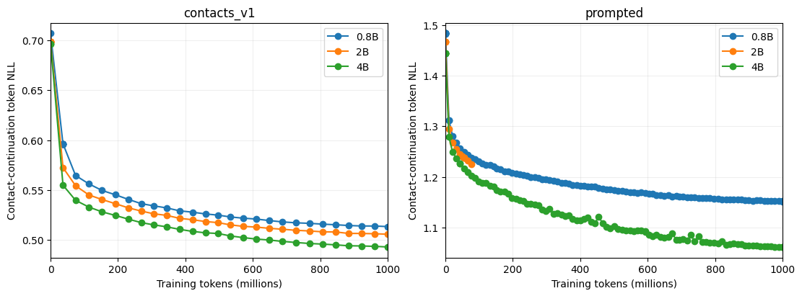

---
marinfold_experiment:
  issue: 347
  title: 'exp: fine-tune Qwen3.5 base models for protein contacts'
  kind: models
  branch: exp/347-qwen-base-contacts
---

# exp: fine-tune Qwen3.5 base models for protein contacts

**Issue:** [#347](https://github.com/Open-Athena/MarinFold/issues/347) · **Kind:** `models` · **Branch:** `exp/347-qwen-base-contacts`

## Question

Can pretrained Qwen3.5 base language models learn protein contacts more effectively than our models trained from scratch? Does a natural-language instruction and ordinary protein sequence improve learning relative to directly continuing pretraining on contacts-v1 documents?

## Hypothesis

General pretraining may supply useful sequence, indexing, and output-format priors. A plain-language contact-prediction prompt may make those priors easier to use. The effect may vary with model size.

## Approach

- Fine-tune the pretrained **base** checkpoints Qwen/Qwen3.5-0.8B-Base, Qwen/Qwen3.5-2B-Base, and Qwen/Qwen3.5-4B-Base. Pin revisions and retain their pretrained tokenizers.
- Compare two document formats at each size: existing contacts-v1 documents; and a simple natural-language format description followed by the protein sequence and the corresponding contacts.
- Use matched examples from the existing exp225/exp232 decontaminated corpus and document all transformations, tokenization expansion, masking, and truncation decisions. Use text-only model components; train the language model weights, not a randomly initialized replacement.
- User-approved first-pass budget: approximately **1B training tokens per trial**, six trials, at most **48 H100 GPUs** concurrently. Begin with correctness and GPU smoke tests, then batch-priority CoreWeave training. No bulk cross-region data transfers.
- Log to open-athena/MarinFold, record run history, retain resumable checkpoints with tokenizer and pinned configuration, and compare validation contact likelihood, output validity, and contact-prediction metrics. Use eval-val for development; do not tune on eval-test.

## Success criteria

All six training runs complete their declared budget and have recoverable model/tokenizer artifacts. Report data and compute exposure, learning curves, and matched contact-prediction validation results, with honest limits on attribution to pretraining and document format. This initial experiment has no matched random-initialization control, so comparisons against existing models are contextual rather than a causal pretraining ablation.

## Implementation

[`common.py`](common.py) pins the three Hugging Face revisions and defines the
plain-language prompt. [`prepare.py`](prepare.py) selects 512 source shards by a
stable SHA256 ordering from the existing exp232 AFDB mirror. Both formats retain
the complete sequence and complete original contact list. A row is excluded from
both formats when either exceeds 16,384 native Qwen tokens or when it has no
contacts. No document is cropped, split into context-free fragments, or packed
with another protein. The prompted arm decodes cyclic positions to the ordinary
sequence and numbers contact endpoints from 1. Its contact order and orientation
match the original document. Sequence-cluster hashes reserve 1% for validation.
Malformed input aborts preparation.

Both arms optimize all next-token targets, including their prefixes. Equal token
budgets therefore compare the complete formatting treatments: they do not isolate
natural language from position numbering, tokenization efficiency, or protein
exposure. The prompted arm sees more proteins per billion tokens. Training reports
document and contact exposure along with token counts. Token NLL across different
formats is not directly comparable; downstream contact metrics remain necessary.

[`train.py`](train.py) loads the pretrained text backbone with no missing weights,
keeps Qwen's tokenizer, and updates all language-model weights. The vision tower
and unused MTP head are omitted. Eight H100s per trial use DDP, FP32 parameters and
Adam states, BF16 autocast, gradient checkpointing, sharded optimizer states, and
Liger's functional fused vocabulary loss. The DeltaNet fast kernels are required;
there is no silent slow fallback or runtime monkey patch. Learning rate is 2e-5,
with 1% token warmup and cosine decay to 10%; AdamW uses betas (0.9, 0.95), weight
decay 0.1, and gradient clipping at 1.0. Four complete documents per GPU form each
accumulated optimizer step, with a global token-normalized objective. The final
step can exceed 1B by at most one global batch.

Production attempts save after their first update, every two minutes, and at
completion. Each rank saves its optimizer/RNG/data cursor
and rank zero saves the model/tokenizer. A completion marker precedes movement of
the resume pointer; only then can the previous resumable checkpoint be removed.
Resumed production skips a duplicate validation pass at the restored step;
validation still runs every 250 steps and at completion, and smoke recovery
checks still validate the restored state.
The final export also includes BF16 inference weights and tokenizer. Resume keeps
the same run identity and requires the original rank count (eight for pilots). Working artifacts are
under `s3://marin-us-east-02a/MarinFold/exp347_qwen_base_contacts/`; durable public
publication and contact-generation evaluation follow completed training.

[`launch.py`](launch.py) submits one explicitly chosen trial through the Marin
controller at batch priority, pins the PyTorch container digest, forwards W&B
credentials without recording them, and records the dispatch in sweep SQLite.
The training environment is pinned in [`uv.lock`](uv.lock), with the SHA256-pinned upstream causal-conv1d
1.7.0 CUDA 12 / torch 2.10 wheel in
[`gpu_bootstrap.sh`](gpu_bootstrap.sh). Initial Iris submission used marin commit
`16ed2b63cdf810fc444930138ac3a35f53260e71`.

## Full-corpus 4B continuation and periodic evaluation

On October 5 the user requested full-scale 4B training with periodic eval-val
R-precision. The working default is both document formats, **100B additional
native tokens each**, evaluated every **1B additional tokens**, within the existing
48-H100 cap. This numerical budget and retaining both formats are stated operator
assumptions, not additional user-specified requirements. Each new phase starts
from its corresponding 1B pilot's FP32 weights, with a fresh optimizer and corpus
cursor; the larger corpus makes this a distinct training phase.

The original scale-up was incorrectly described as the full corpus: it used only
exp232's AFDB component (3,717,047 eligible training rows). The user corrected
this on October 5. Both `*-full-100bt-a01` jobs and their waiting evaluation
drivers were stopped; these runs are **superseded AFDB-only continuations**.
Their manifests and initial timings remain as historical artifacts under
`data/full_corpus/` and `data/full_phase_initial_timings/`; they are not the
current full-corpus configuration. No accuracy claim uses the short continuations.

The replacement uses the latest ready pool from
[exp343](https://github.com/Open-Athena/MarinFold/issues/343), incorporating the
four monomer corpora from [exp277](https://github.com/Open-Athena/MarinFold/issues/277):

| Source | Published source documents | Parquet shards |
| --- | ---: | ---: |
| Native AFDB | 3,963,003 | 2,067 |
| Native ESM-Atlas | 65,553,178 | 3,338 |
| MPNN AFDB redesigns | 31,702,680 | 199 |
| MPNN ESM redesigns | 130,872,044 | 3,338 |
| Complex training documents | 3,400,000 | 170 |
| **Total** | **235,490,905** | **9,112** |

These are document counts, including redesign sequences, not unique native
backbones. `corpus_catalog.py` audited every parquet footer and object ETag in
the existing CoreWeave east bucket. The compact
[`source manifest`](data/corpus235m/manifest.json) pins the complete catalog hash.
The data prefix is
`s3://marin-us-east-02a/MarinFold/exp347_qwen_base_contacts/data/corpus235m-v1`.
No cross-region corpus transfer is involved. Exp343's 10,738 complex validation
rows are excluded; exp292's unpublished supplementary sequences are not added.

`corpus_stream.py` reads bounded projected batches and tokenizes online with the
unchanged Qwen tokenizer. Every source is available from the first update. Ranks
have disjoint shuffled shard assignments; each draw selects a source in proportion
to its remaining raw rows. Every assigned source row is visited once per rank
epoch, without replacement, with deterministic 128-row batch shuffling. This is
not a uniform permutation of all individual documents. Exact recovery includes
all source cursors, the catalog hash, rank layout, and cumulative admission counts.

The **235.49M total is before experiment-specific filters**. Both formats exclude
empty-contact documents and any pair of renderings exceeding 16,384 native tokens.
The original 1% sequence-cluster holdout is inherited by native and MPNN sequences;
complexes use their upstream `cluster_key` for the same hash holdout. The 64-document
pilot AFDB likelihood diagnostic is retained. Training logs seen, accepted,
validation, empty-contact and over-length counts separately for each source.
Whole-corpus eligible counts and native-token totals are not yet measured; no
number of complete passes is inferred from the old AFDB-only cache.

The converter now preserves multiple disjoint cyclic chain intervals. Complex
prompts expose numbered chains and residue ranges, allowing inter-chain contacts
at any separation while retaining the within-chain separation rule. Monomer
prompts are unchanged. Published upstream contact truncation is retained as-is;
this experiment does not introduce additional cropping. A real eight-rank CPU
sample admitted examples from every source and replayed all next-row cursors.

`torch_launch.py` uses the Iris endpoint registry and Torch's supported rendezvous
options for a fixed gang. Training stages weights once per node and uses local
CUDA ranks; exact optimizer recovery requires the same world size. The full phases use eight H100s per arm plus up to four single-H100
evaluation workers per arm. With the continuing eight-GPU 2B pilot this is at
most 32 GPUs, below the user’s 48-GPU cap. The two-node test passed training
and durable export checks after static rendezvous and explicit selection of
Iris’s routable IPv4 network interface. It reached only 17.6K tokens/s versus
roughly 27–34K for the existing one-node raw profile. Native InfiniBand was
unavailable in the pinned image (`libibverbs.so` missing), so the long runs use
the proven, faster one-node configuration. Their batch remains 32 complete
documents per optimizer update. The two-node profile is not eligible for
production until its image and throughput are validated.

The replacement identities are
`exp347-qwen35-4b-contacts_v1-corpus235m-100bt` and
`exp347-qwen35-4b-prompted-corpus235m-100bt`. They initialize from the original
1B pilot steps 6496 and 22268, respectively, so the mistaken AFDB-only extensions
are not folded into the corrected comparison. Phase token counts are additional
exposure: checkpoint zero is the corresponding 1B pilot. Jobs have a 90-day
execution timeout and retain resumable state; the 100B budget is not a guarantee
of completion within that time. The new source stream is undergoing a real 4B
training/checkpoint/recovery smoke before the production replacements launch.

`eval_contract.py` freezes the **97-protein eval-val set** from exp245's pinned
membership, sequences, and resolved-residue ground truth. It never selects
`eval-test`. The evaluator samples **100 rollouts**, temperature 1, top-p 0.95,
and top-k disabled, then calls the unchanged exp89 metric implementation.
Contacts-v1 prompts resample N-terminal offset and sequence-statement order;
only live, valid contacts vote, once per pair per rollout. Prompted models use
100 independent samples of their fixed natural-language/ordinary-sequence prefix.
Because native Qwen symbols split into multiple tokens, the canonical `6L+128`
protein-token allowance is translated to native tokens with equivalent contact
statement capacity. This vocabulary and fixed-prefix adaptation is explicit;
it is not an identical-tokenizer or identical-resampling comparison.

`eval_worker.py` saves raw completions, symmetric vote matrices, exact checkpoint
and input provenance, and per-protein timings. A Qwen rollout that reaches its initial allowance continues from its exact
sampled token prefix with an independent continuation RNG stream, retaining
already terminated samples. Continuation stops at termination or the 64K context
limit. A still-capped rollout aborts the measurement before its completion marker;
continuation counts are recorded. The fixed E8 reference allowance is unchanged. `aggregate_eval.py` requires every
expected unit and all 20 canonical metric rows before publishing an aggregate.
The new runtime passed the E8 legacy554 reference gate: all R=0.42437655 and
long R=0.36598821 against reference 0.4245291 and 0.3656152 (tolerance 0.005).
All 554 units completed 100 rollouts with no truncation. The metric and timing
tables are committed in [`data/e8_reference`](data/e8_reference).

`periodic_eval.py` runs inside a persistent Iris CPU job and executes the fixed
checkpoint schedule on four GPU children, waiting for every child before scoring.
Training retains periodic BF16 model/tokenizer exports under
`checkpoints/<run>/hf/step-<N>/` independently of rolling optimizer checkpoints.
An immutable request appears only after checkpoint completion; resume repairs a
request interrupted between checkpoint commit and request publication. Evaluation
results log to a dedicated W&B run against checkpoint tokens, including the final
measurement after training exits. The trainer also imports completed all/long
R-precision while running. Iris handles preemption; there is no scheduled agent
that diagnoses or repairs arbitrary failures.

## Results

As of **2026-10-05 13:25 UTC**, five production trials have finished their
approximately 1B-token budgets. Both Iris and W&B report successful completion.
Their final completion markers, eight optimizer shards, model/tokenizer files,
and BF16 inference exports were verified directly in co-located storage on
October 5. Contacts-v1 finishes at step 6496; prompted finishes at step 22268.
The 320 per-protein timing rows from these final validation passes are included
in [`data/timings.csv`](data/timings.csv).
The 2B prompted trial stopped on October 3 after a distributed communication
timeout at step 1809 (79.61M tokens). A replacement attempt was submitted on
October 5, restored step 1773 (78,142,147 retained tokens), and completed its
first resumed update under the same run identity.

Validation below uses the same 64 held-out AFDB documents. Lower contact-token
negative log likelihood (NLL) is better **within each format**. The incomplete
2B prompted result is not a matched-budget comparison.

| Model | Format | Training tokens | Initial NLL | Latest NLL | Training status |
| --- | --- | ---: | ---: | ---: | --- |
| 0.8B | contacts-v1 | 1,000,038,409 | 0.70685 | 0.51342 | Finished |
| 2B | contacts-v1 | 1,000,038,409 | 0.69876 | 0.50577 | Finished |
| 4B | contacts-v1 | 1,000,038,409 | 0.69670 | 0.49301 | Finished |
| 0.8B | prompted | 1,000,005,730 | 1.48312 | 1.15186 | Finished |
| 2B | prompted | 79,608,805 before failure | 1.46629 | 1.22514 at 77.14M tokens | Resumed from 78.14M |
| 4B | prompted | 1,000,005,730 | 1.44411 | 1.06211 | Finished |

The completed trials favor larger models on this likelihood diagnostic.

The two 4B pilots were evaluated on all 97 eval-val proteins on October 5,
with 100 completed rollouts per protein and no unfinished samples:

| 4B format, after 1B tokens | All-range R-precision | Long-range R-precision |
| --- | ---: | ---: |
| contacts-v1 | 0.14010 | 0.10083 |
| prompted | 0.14350 | 0.09894 |

The format differences are below the approximately 0.005 evaluation resolution.
These starting points are substantially below the existing exp232 m2-p06 model
(0.51980 / 0.50173 on the same set). The full decontaminated AFDB sequence-KNN
null is 0.40715 / 0.39211; that is corpus-level context, not an exact null for
the pilots' 512-shard training subset. No pretrained-transfer advantage is
established. Equal native-token budgets also expose the two formats to different
numbers of proteins.

The six viral targets score all-range R=0.12826 / 0.12572 for raw / prompted;
the 91 nonviral targets score 0.14088 / 0.14467. The viral sample is small.
The frozen low-MSA-depth natural FoldBench cut belongs to eval-test, so it is
not read for this eval-val-only experiment. One prompted sample on `7xp9_A`
needed prefix-preserving continuation; all 9,700 final samples per arm terminated.
[`data/eval_val_pilot`](data/eval_val_pilot) contains the complete metric and
timing tables; `summarize_eval_val.py` regenerates the viral split. These tables
and the E8 reference are also in the
[public HF bucket](https://huggingface.co/buckets/open-athena/MarinFold),
published by `publish_to_hf.py`.

The one-shard data smoke succeeded on 2026-10-02:
`/timodonnell/exp347-data-smoke-a01`. Of 1,887 source rows, 98 exceeded 16K and one
had no contacts. The retained 1,766 training / 22 validation rows preserve all
contact information. Training text contains 11,302,406 contacts-v1 tokens versus
3,244,662 prompted tokens (3.48x expansion for contacts-v1). These numbers describe
the smoke shard, not the complete corpus.

Full preprocessing completed as `/timodonnell/exp347-prepare-a01`; the
per-shard source hashes and counts are committed in [`data/manifest.json`](data/manifest.json).
From 981,860 source rows, it excluded 50,220 over-length rows (5.11%) and 1,794
empty-contact rows. The shared pool has **920,611 training** and **9,235 validation**
documents, containing 151,261,429 training contacts. The native-token totals are
**4,493,121,575 contacts-v1** and **1,289,984,389 prompted**. Each 1B-token arm can
finish without a second corpus pass, although protein exposure differs by format.
The pinned 0.8B and 2B checkpoints were staged successfully by
`/timodonnell/exp347-stage-small-a02` and their tokenizers are exactly equal.
The first GPU attempt was preempted during dependency compilation. The pinned
upstream CUDA wheel removed that build; attempt
`/timodonnell/exp347-qwen35-0p8b-contacts_v1-smoke-a02` then completed successfully.
It processed 137,698 tokens in four optimizer steps, saved all eight optimizer
shards and model/tokenizer artifacts, and reached 45,007 tokens/s in the last step
with 12.53 GB peak allocated GPU memory. The [smoke W&B run](https://wandb.ai/open-athena/MarinFold/runs/exp347-qwen35-0p8b-contacts_v1-smoke)
has initial/final contact-continuation validation metrics. These tiny smoke values
are engineering checks, not contact-accuracy results. Attempt a03 restored that state, exactly reproduced its validation NLL,
performed step 5 (174,050 cumulative smoke tokens), and saved another checkpoint.

The 2B prompted smoke also completed as
`/timodonnell/exp347-qwen35-2b-prompted-smoke-a01`
([W&B](https://wandb.ai/open-athena/MarinFold/runs/exp347-qwen35-2b-prompted-smoke)).
It processed 109,508 tokens in ten steps, used 29.09 GB peak allocated memory,
and saved its model, tokenizer, and eight optimizer shards at step 10.
The 2B contacts-v1 smoke completed as
`/timodonnell/exp347-qwen35-2b-contacts_v1-smoke-a01`
([W&B](https://wandb.ai/open-athena/MarinFold/runs/exp347-qwen35-2b-contacts_v1-smoke)).
Its step-4 checkpoint contains 137,698 training tokens; peak allocated memory
was 28.74 GB. Both 2B checkpoint directories and all rank shards were verified.

Fifteen document/cursor/output-parser/export/distributed-update tests, eight capacity-helper tests, Ruff,
and Pyrefly passed. A two-rank CPU numerical check also confirmed that the
accumulated gradients match a single globally token-weighted reference loss.
Measured per-input validation times are retained in [`data/timings.csv`](data/timings.csv).

## Conclusion

Five of six pilot training trials have completed. Larger models have lower
validation contact-token NLL within each format. The two 4B pilots have similar,
low eval-val R-precision (0.14010 / 0.14350 overall); the full-scale phase will
measure whether additional protein training improves this. The matched-budget
2B prompted result remains outstanding.

## Production training

The 0.8B contacts-v1 arm was launched as
`/timodonnell/exp347-qwen35-0p8b-contacts_v1-1bt-a01`
([W&B](https://wandb.ai/open-athena/MarinFold/runs/exp347-qwen35-0p8b-contacts_v1-1bt)).
The first 17 steps processed 2.63M tokens; steady early steps reached about
39–53K tokens/s over eight H100s. Validation at initialization uses 64 documents
from the held-out sequence clusters. This is a running experiment, not a final
result. At step 250 (36.92M tokens), contact-continuation validation NLL fell
from 0.70685 to 0.59605. This measures held-out likelihood, not contact accuracy.

The 0.8B prompted and both 2B arms have also been launched with the same
1B-token budget:
[0.8B prompted W&B](https://wandb.ai/open-athena/MarinFold/runs/exp347-qwen35-0p8b-prompted-1bt),
[2B contacts-v1 Iris job](https://iris.oa.dev/#/job/%2Ftimodonnell%2Fexp347-qwen35-2b-contacts_v1-1bt-a01),
[2B prompted W&B](https://wandb.ai/open-athena/MarinFold/runs/exp347-qwen35-2b-prompted-1bt).
The user approved the remaining 4B transfer on 2026-10-02. Job
`/timodonnell/exp347-stage-4b-a01` staged 9,342,808,116 bytes and verified exact
tokenizer equality across all three sizes. The revision and file checksums are
retained in [`data/model_staging_4b.json`](data/model_staging_4b.json).
The 4B training/checkpoint smoke completed as
`/timodonnell/exp347-qwen35-4b-contacts_v1-smoke-a01`
([W&B](https://wandb.ai/open-athena/MarinFold/runs/exp347-qwen35-4b-contacts_v1-smoke)).
It processed 137,698 tokens, used 54.69 GB peak allocated GPU memory, and saved a
step-4 checkpoint. All 29 checkpoint files were verified, including model,
tokenizer, BF16 export, and eight optimizer shards.

[`collect_metrics.py`](collect_metrics.py) plots the committed
[`data/learning_curves.csv`](data/learning_curves.csv), and its optional refresh
mode retrieves the latest production histories from W&B. The two formats use
different tokenizations of the contacts, so their token NLLs are not directly
comparable. The refreshed October 5 plot includes final results for five trials
and partial results for 2B prompted. Replayed steps after preemption remain in
the recorded histories.

The 2B prompted root a03 failed at 2026-10-03 00:13 UTC after a 600-second
scalar ALLREDUCE timeout. Ranks 4 and 6 had not enqueued that collective; no
preceding OOM was recorded. The underlying cause is unresolved. Since the other
five trials completed with the same training code, a single controlled resume
was submitted as a04 on October 5. It retains the original budget and settings,
and requests eight H100s at batch priority. A repeated failure requires further
diagnosis before another retry.

The latest Iris roots are `/timodonnell/` followed by:

| Model | contacts-v1 | Prompted |
| --- | --- | --- |
| 0.8B | `exp347-qwen35-0p8b-contacts_v1-1bt-a03` | `exp347-qwen35-0p8b-prompted-1bt-a04` |
| 2B | `exp347-qwen35-2b-contacts_v1-1bt-a03` | `exp347-qwen35-2b-prompted-1bt-a04` |
| 4B | `exp347-qwen35-4b-contacts_v1-1bt-a04` | `exp347-qwen35-4b-prompted-1bt-a04` |

Both 4B W&B identities are registered:
[contacts-v1](https://wandb.ai/open-athena/MarinFold/runs/exp347-qwen35-4b-contacts_v1-1bt)
and [prompted](https://wandb.ai/open-athena/MarinFold/runs/exp347-qwen35-4b-prompted-1bt).
The first 4B raw production attempt saved step one, then exhausted GPU memory
in Liger's weight-gradient allocation on step two. Later NVLink errors were
secondary. Preserving [DDP gradient bucket views](https://docs.pytorch.org/docs/2.10/generated/torch.nn.parallel.DistributedDataParallel.html)
and enabling [expandable allocator segments](https://docs.pytorch.org/docs/2.10/notes/cuda.html)
allowed attempt a02 to reach step 21 at roughly 27-34K tokens/s, before another
preemption. A two-process sharded-AdamW test verifies multiple accumulated
updates against a single global reference.

Repeated short allocations erased work before the original 15-minute and later
five-minute checkpoints. All current bundles save after the first update of
EVERY attempt and every two minutes. Skipping redundant restored-step validation
exposed an accidental dependency on validation to set training mode: the backbone
now explicitly enters training mode at construction, retaining activation
checkpointing. A real HF save/load regression test covers this path. The latest
bundles contain both fixes. Trial identities, data, batch size, objective, and
budgets remain fixed.

The shorter cadence has produced new durable checkpoints for the 0.8B prompted
and 2B raw arms, which had previously kept restarting from zero. W&B high-water
progress can exceed the most recent durable checkpoint, so it must not be read
as retained progress. The 2B prompted validation NLL fell from 1.46629 initially
to about 1.2375 at step 1250; this is held-out likelihood, not contact accuracy.

Read-only node inspection found that aggregate free-GPU counts included cordoned
nodes. The launcher permits a CPU reservation of 32 (four threads per rank), but
this does not resolve admission when no schedulable whole GPU node is available.

The BF16 export now preserves tied embedding/output tensors. Save/reload tests
cover both tied and untied Qwen configurations and exact BF16 values. The initial 0.8B/2B smoke exports predate this correction;
any publication of those exports must re-export their FP32 model with the
corrected exporter. Updated production bundles include the correction.

[`rollout_validation.py`](rollout_validation.py) provides a separate greedy
completion diagnostic on those held-out AFDB documents, retaining each output,
invalid/duplicate pair count, token-cap flag, precision/recall/F1, and timing. It
is explicitly not the established FoldBench rollout-plus-resample benchmark and
its numbers must not be compared to that benchmark's R-precision.
The eight-protein-per-format generation canary,
`/timodonnell/exp347-generation-smoke-a02`, completed using the saved 2B smoke
checkpoints and a deliberately short 256-token cap. All 16 generations hit that
cap and produced zero valid contact pairs (F1 zero): prompted outputs repeated
`100 100`, while raw outputs continued position symbols. The code path runs, but
these approximately 100K-token smoke models do not demonstrate contact prediction.
Results are in [`data/generation_canary_metrics.csv`](data/generation_canary_metrics.csv),
with measured inference times in the timing CSV. Full-budget models need longer
completion evaluation before an accuracy comparison can be made.
