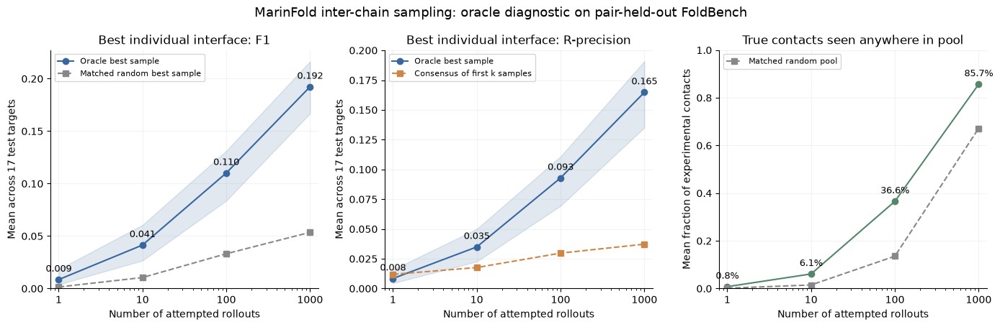
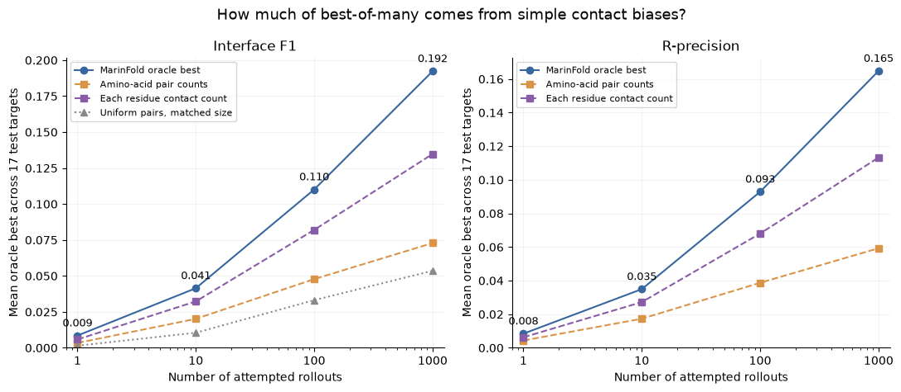

---
marinfold_experiment:
  issue: 350
  title: 'exp: curate 30%-held-out experimental complexes and evaluate contacts plus Helico structures'
  kind: evals
  branch: exp350/complex-survival-audit
---

# exp: curate 30%-held-out experimental complexes and evaluate contacts plus Helico structures

**Issue:** [#350](https://github.com/Open-Athena/MarinFold/issues/350) · **Kind:** `evals` · **Branch:** `exp350/complex-survival-audit`

## Question

Can we construct a useful evaluation set of experimental protein complexes under either of two holdout definitions: **component-held-out**, where every chain is below 30% identity to every training chain, or **pair-held-out**, where no training complex contains homologs of both chains? Can it support exp343 inter-chain contact R-precision and structural evaluation with Helico?

The first deliverable was a **survival table and an evidence-backed feasibility
decision**. The experiment now also freezes the selected FoldBench benchmark and
its contact-scoring universe before running predictors.

## Hypothesis

A freshly audited subset of FoldBench protein–protein assemblies is the best starting point because existing monomer training data was filtered against all FoldBench chains. The strict component rule may have poor yield, while the pair rule should retain complexes whose component families were seen separately but whose relationship was not. PINDER test dimers can add independent clean pairs.

## Background

- #343 / #349 trained `contacts-v1-exp343-m2-p06-complex-1.5B`, final step 280154, on exp277's native + ProteinMPNN mixture and #294's AFCDB/PINDER complexes. Complex LM loss improved, but experimental interface R-precision and assembly quality have not been measured.
- #225 intended to filter native AFDB and ESM-Atlas against the legacy eval union and all FoldBench protein chains at >=30% identity over >=50% of the shorter sequence. Its search used MMseqs' default alignment mode, whose score-derived identity estimate can disagree with an exact backtrace at this boundary; this audit checks the corpus the checkpoint actually consumed.
- #266 generated ProteinMPNN redesigns of retained native backbones; their actual sequences also need auditing.
- #294 filtered its complexes against the 577-target monomer eval reference and excluded PINDER val/test entries. This does not certify FoldBench complex chains against the final training mixture.
- FoldBench's protein–protein CSV contains 279 interfaces from 239 assemblies at local revision `90a6033fed4fcb74d4f1304e932fd93b52d48a6c`. PINDER-XL advertises 1,955 representative dimers. Neither is a post-filter count.
- Helico supports chain-aware contact inputs, but its benchmark runner currently selects the best ground-truth score across seeds and fixes DockQ chain mapping by chain names. These paths require adaptation before reporting confidence-selected, symmetry-aware end-to-end results.

## Approach

### Stage A — survival audit

1. Pin source versions and the exact exp343 training manifest, including the held-out complex shard. Inventory reusable local sequence indexes and published metadata before building or transferring anything large.
2. Census FoldBench protein–protein assemblies and PINDER test dimers. Lead with natural, protein-only biological dimers; distinguish homo/heterodimers, designs, antibodies/peptides, higher assemblies, unsupported chemistry, incomplete interfaces and context-ineligible inputs. Preserve every candidate with a named terminal status.
3. Define a contaminating sequence hit as **identity >=0.30 and aligned coverage >=0.50 of the shorter sequence**. Evaluate two rules. The strict component rule rejects a complex if either chain hits any training chain. The pair rule rejects it only if one training complex document has a one-to-one assignment of both candidate chains to homologous chain instances. Use sensitive alignment searches with pinned parameters, explicit identity/coverage conventions, adequate hit limits and threshold checks. Preserve supporting alignments; an unsearched component is unknown, never a pass.
4. Audit native AFDB, native ESM-Atlas, both actual ProteinMPNN sequence corpora, and both complex-source arms (AFCDB/PINDER). Reuse complete earlier alignments only with verified sequence and corpus provenance. Keep source-backbone lineage for redesigns and distinguish exact entries, homologs, and structural relatives.
5. Audit Helico's inherited Protenix and contact-conditioning training exposure separately. Record MarinFold-clean and end-to-end-clean eligibility independently; temporal separation alone is not 30% sequence separation. Identify targets previously used for Helico development.
6. Produce per-source and cumulative survival counts, by homo/heterodimer, plus per-chain evidence and per-complex rejection reasons. Report independent sequence/interface groups rather than treating multiple interfaces or repeated structures as independent targets.
7. Decide whether FoldBench suffices, whether PINDER adds useful clean targets, or whether newer experimental PDB assemblies are needed. Do not weaken the identity rule to increase yield. For the existing checkpoint, filter evaluation candidates; removing training rows retrospectively cannot repair contamination.

### Stage B — freeze the benchmark

After the survival audit is reviewed, freeze biological-assembly identities, sequences, coordinate snapshots, residue/chain mappings, experimental-quality criteria, context eligibility and all exclusion reasons. Split development/test by connected homology groups and keep repeated interfaces/assemblies together. Previously used development targets belong in development. Keep antibodies, peptides, designs and higher-order complexes as explicitly separate extensions.

### Stage C — contact evaluation

Use the established 100-rollout/resampling recipe, adapted and validated for multi-chain contacts-v1. Rank all eligible resolved cross-chain residue pairs, with no intra-chain sequence-separation exclusion applied across chains. Ground truth uses the pinned pyconfind contacts-v1 operator and threshold. Primary metric: inter-chain R-precision, where R is the number of true interface contacts. Report intra-chain accuracy, completeness, uncertainty, and appropriate null/control predictions separately. Handle equivalent-chain permutations consistently.

### Stage D — Helico structural evaluation

Compare no contacts, predicted intra-chain contacts only, predicted intra+inter-chain contacts, and oracle contacts as a diagnostic ceiling. Select contact budgets on development data; true R must never set inference inputs. Pin Helico weights/code and use confidence-based sample selection; label ground-truth best-of-N only as oracle. Primary structural metric: DockQ and success at DockQ >=0.23, with interface RMSD and per-chain quality. Use symmetry-aware chain mapping and matched baselines with explicit training exposure. Aggregate within assemblies and bootstrap independent complex groups.

## Success criteria

- A reproducible survival table with exact candidate denominators, per-corpus losses, independent-group counts, explicit unknowns and actionable conclusions about dataset feasibility.
- Frozen FASTA/manifests, sequence-search provenance and per-chain supporting alignments; no unsupported claim that a candidate passed an unsearched training component.
- Clear separation of MarinFold-only holdout from end-to-end Helico holdout and prior development exposure.
- If a viable dataset exists, a frozen development/test split and later per-complex R-precision and structural results with confidence selection and uncertainty.
- Every eventual predictor run records per-input timing, worker metadata, exact model/run/step and code revisions. Small CSVs/plots live in git; large artifacts go to the public MarinFold HF bucket, with working compute/storage co-located.
- No predictions are required for Stage A. No cross-region copy above 10 GB or shared-cluster disruption is authorized.

## Results

The answer depends on the holdout claim. The strict component-held-out rule is
not viable: it leaves zero FoldBench complexes and one PINDER homodimer after
the locally auditable MarinFold arms, and that last target is exposed to
Helico's documented fine-tuning pool. The proposed pair-held-out rule is viable
for a benchmark of unseen chain-family pairings.

| cumulative stage or definition | FoldBench PPI | PINDER test |
| --- | ---: | ---: |
| source assemblies/dimers | 239 | 1,955 |
| natural protein-only dimers passing scope/quality | 184 | 1,929 |
| strict component-held-out after local MarinFold arms | **0** | **1** |
| pair-held-out after AFCDB complex training | 40 | 187 |
| pair-held-out after PINDER complex training | **35** | **183** |
| pair-held-out plus conservative Helico fine-tuning screen | **32** | **65** |

For the pair rule, a complex training document is contaminating only when its
two chain instances can be assigned one-to-one to the two candidate chains and
both exact alignments pass 30% identity over 50% of the shorter sequence. An
AFCDB homodimer has two chain instances even though its decoded FASTA stores one
deduplicated sequence. PINDER training documents require two distinct stored
chains. The single-chain native AFDB, ESM-Atlas and ProteinMPNN documents cannot
contain a paired witness and therefore do not exclude candidates under this
definition.

The final MarinFold pair-held-out pool contains 218 dimers. FoldBench contributes
15 homodimers and 20 heterodimers; PINDER contributes 40 homodimers and 143
heterodimers. A conservative Helico screen rejects a candidate when two distinct
chains from the same documented fine-tuning PDB entry match the candidate pair.
It leaves 97 dimers: 13/19 FoldBench homo/heterodimers and 13/52 PINDER
homo/heterodimers. Helico's inherited Protenix pretraining exposure remains
unreconstructed, so 97 supports a fine-tuning-pair-clean claim rather than a
fully certified end-to-end holdout claim.

The broad complex-corpus search reached its 100,000-result median prefilter cap.
All 220 apparent survivors were therefore searched again with a 1,000,000-result
cap. The confirmation median was 86,868, below the cap, and two additional
PINDER AFCDB pair witnesses were found, producing the final count of 218. Exact
MMseqs backtraces (`--alignment-mode 3 -a 1`) provide `nident`; the 30% boundary
is applied with integer arithmetic. This avoids the earlier score-derived
identity error, exemplified by an 8AXI-A/ESM-Atlas alignment estimated at 29.7%
but containing 200 identities over 620 aligned positions (32.26%).

Reproduce the pair analysis and figure after preparing the local indexes:

```bash
uv run python analyze_pair_survival.py
uv run python select_pair_queries.py
uv run python search_sequences.py --arm complex \
  --queries data/pair_queries.fasta --work /data/exp350_pair_confirm \
  --target-db /data/exp350/complexDB --max-seqs 1000000 --threads 48
uv run python analyze_pair_survival.py --complex-alignments \
  /data/exp350/complex_query_alignments.tsv \
  /data/exp350/complex_target_alignments.tsv \
  /data/exp350_pair_confirm/complex_query_alignments.tsv \
  /data/exp350_pair_confirm/complex_target_alignments.tsv
uv run python plot_pair_survival.py
uv run python build_summary.py
```

Search commands, hashes, counts and compact witness tables are committed under
`data/`. The complete compressed alignment evidence and logs are public in the
[MarinFold HF bucket](https://huggingface.co/buckets/open-athena/MarinFold/tree/main/data/evals/exp350_complex_holdout_survival/evidence).

### Frozen FoldBench benchmark

The final benchmark uses FoldBench alone. All targets postdate FoldBench's
2023-01-13 cutoff, which keeps the Helico comparison after the inherited
Protenix v1 pretraining window. The date cutoff does not protect against
Helico's later fine-tuning data, so the three observed same-PDB pair-homology
hits remain excluded. Manual citation review also found two de novo binder
targets missed by the original title heuristic; those are recorded as designed
extensions rather than pooled with natural complexes.

| freeze stage | complexes | homodimer | heterodimer |
| --- | ---: | ---: | ---: |
| MarinFold pair-clean FoldBench candidates | 35 | 15 | 20 |
| after Helico fine-tuning pair screen | 32 | 13 | 19 |
| natural frozen benchmark | **30** | **13** | **17** |

The 30 structural targets form 26 connected homology groups under the same exact
30% identity / 50%-of-shorter rule. Twenty-five groups are singletons; one
five-target group shares a ubiquitin-family partner. A full-context diagnostic
then ran 100 rollouts per target. Seven homodimers had at least one rollout use
the checkpoint's complete 8,192-token context without finishing: 147 of 3,000
diagnostic rollouts. A strict 100-rollout contact score would therefore be
undefined for those targets. They remain in the structural source set, but the
primary contact and contact-conditioned structural evaluation uses the 23
context-complete targets.

The contact set contains 19 connected homology groups, 6 homodimers and 17
heterodimers. Its deterministic metadata-only split assigns 6 targets to
development and 17 to test. Mean total length is 361.33 versus 361.29 residues,
respectively. Report contact coverage as 23/30 alongside R-precision; do not
treat truncated generations as finished samples. The context audit and
filtered target table are public in the [MarinFold HF
bucket](https://huggingface.co/buckets/open-athena/MarinFold/tree/main/data/evals/exp350_foldbench_pair_holdout/contact_eval_v1).

For contact scoring, each target has a full canonical two-chain input, explicit
FoldBench label-chain to mmCIF author-chain mapping, resolved-residue mask and
contacts-v1 pyconfind interface truth in zero-based concatenated-sequence
coordinates. The candidate universe is the Cartesian product of resolved
positions across the two chains. R is the number of inter-chain contacts with
degree >=0.001; the within-chain sequence-separation rule is not applied across
chains. Across the set, R ranges from 10 to 200 contacts and the candidate
universes contain 3,042 to 326,612 pairs.

The structural half preserves the original FoldBench coordinates and native
target CSV layout for Helico/DockQ, plus exact two-protein AF3 inputs. This is
important for assemblies containing extra symmetry copies and for cases where
FoldBench label chain IDs differ from author chain IDs. The 12.3 MB bundle is
public at the [MarinFold HF bucket](https://huggingface.co/buckets/open-athena/MarinFold/tree/main/data/evals/exp350_foldbench_pair_holdout/v1).

Rebuild and publish the frozen set with:

```bash
uv run python freeze_foldbench_eval.py --threads 24
uv run python publish_foldbench_eval.py
```

`foldbench_complex_contact_eval_targets.parquet` is ready for the strict
multi-chain adaptation of the exp82 100-rollout evaluator and carries the
conventional `dataset`,
`stem`, `L`, `input_seq`, `resolved`, `contacts`, and `gt_contacts` fields plus
chain boundaries. `score_foldbench_contacts.py` implements stable top-R scoring
over resolved cross-chain pairs and bootstraps independent homology groups.

The chain-aware rollout worker preserves exp82's 100-sample settings while
giving each chain independent termini and applying the six-residue separation
filter only within a chain. Complex rollouts may use the model's entire
remaining 8,192-token context: launch diagnostics showed that both the exp82
monomer cap of `6L+128` and a `12L+128` cap truncate dense complex outputs.
Targets whose rollouts still truncate at the full model context are
context-ineligible and excluded before scoring. The CoreWeave dispatcher is
pinned to
`contacts-v1-exp343-m2-p06-complex-1.5B-step-280154`, validates the existing
in-region checkpoint mirror, runs at batch priority and records per-target
timings. Each root job retrieves the 160 KB contact target parquet anonymously
from the public HF bundle, avoiding any workstation-to-object-store dependency:

```bash
set -a; source ~/.config/marin/cw-rno2a.env; set +a
/home/bizon/git/marin-freshiris/.venv/bin/python \
  dispatch_foldbench_contacts_cw.py
```

After collecting the score parts, compute the primary metric and prepare the
structural conditioning arms with:

```bash
uv run python score_foldbench_contacts.py \
  --scores <score-dir> --per-target data/contact_r_precision.csv \
  --aggregate data/contact_r_precision_summary.csv
uv run python export_helico_contacts.py \
  --scores <score-dir> --out-dir <helico-arms-dir>
```

The exporter produces top-L/5, top-L/2 and top-L arms both with all predicted
contacts and with intra-chain contacts only. Budgets depend on input length,
never true R. Choose the budget on development, then run Helico on test with
four arms: contacts withheld, predicted intra-chain, predicted intra+inter-chain
and oracle. Use one trunk seed so Helico's built-in confidence ranking selects
among diffusion samples without the benchmark runner selecting a seed by
ground-truth DockQ. Report DockQ, DockQ >=0.23 success, iRMSD and lRMSD.

### Final contact and structural evaluation

The exp343 checkpoint completed 100/100 rollouts for every one of the 23
context-eligible targets, for 2,300 usable rollouts and no unfinished samples.
On the 17-target test split, mean inter-chain R-precision is **0.0260** (95%
homology-group bootstrap interval **[0.0036, 0.0453]**) versus a
resolved-interface-universe random expectation of **0.0028**. The six-target
development split is near random: 0.0043 versus 0.0043. The test score is about
9.3 times its random expectation, but its absolute precision remains low.

The contact budget was selected using only the six development targets.
All-contact top-L reaches mean pair-specific DockQ **0.1284**, compared with
0.0381 for L/2 and 0.0329 for L/5, so top-L was frozen before reading the
structural test result. The final confidence-selected Helico comparison is:

| test arm | mean DockQ (95% group bootstrap) | median | DockQ >=0.23 |
| --- | ---: | ---: | ---: |
| contacts withheld | 0.0362 [0.0151, 0.0513] | 0.0215 | 1/17 (5.9%) |
| predicted intra-chain top-L | 0.0546 [0.0214, 0.0878] | 0.0144 | 2/17 (11.8%) |
| predicted all-contact top-L | **0.0697 [0.0258, 0.1023]** | 0.0146 | **2/17 (11.8%)** |
| oracle contacts | 0.8010 [0.7557, 0.8406] | 0.8377 | 17/17 (100%) |

Paired target-level differences sharpen the comparison. All predicted contacts
improve mean DockQ over contacts withheld by **+0.0335 [0.0024, 0.0679]** and
improve 12/17 targets. The all-contact arm also beats the intra-only control by
**+0.0151 [0.0002, 0.0266]**, again improving 12/17 targets. Intra-only versus
withheld is +0.0184 [-0.0061, 0.0585]. These intervals resample the 13 independent
test homology groups and preserve target pairing. The all-versus-intra result
isolates a small positive contribution from predicted interface contacts; the
large oracle ceiling shows that accurate contacts can drive this Helico
checkpoint, while the low absolute predicted-contact success rate leaves ample
room for better contact precision and structure realization.

Helico used `/ckpts/contacts-msafree-01/final.pt` at step 6000 in true
single-sequence mode, one trunk seed, three diffusion samples, six cycles, and
confidence-only sample selection. Scoring is exact-pair, symmetry-aware DockQ
2.1.3 against the frozen FoldBench author chains. The ten development/test arms
produce 104 per-target timing records. Raw contact scores, Helico predictions,
corrected PDB exports, timings and derived tables are published under the
public artifact prefixes recorded in `data/contact_rollout_manifest.json` and
`data/helico_eval_manifest.json`. Browse the [contact rollout
artifacts](https://huggingface.co/buckets/open-athena/MarinFold/tree/main/data/evals/exp350_foldbench_pair_holdout/contact_eval_v1/rollout_v1)
and [Helico evaluation
artifacts](https://huggingface.co/buckets/open-athena/MarinFold/tree/main/data/evals/exp350_foldbench_pair_holdout/contact_eval_v1/helico_v1)
in the public MarinFold HF bucket.

### Oracle best-of-many inter-chain contacts

A requested exploratory follow-up generated **1,000 new attempts per target**
with the same checkpoint and sampling settings (T=1, top-p=0.95, top-k=-1,
8,192-token context). Individual contact maps are now saved. The 23-target
membership and split remain frozen: 10/23,000 attempts were unfinished (two on
development target 8h1m, six on test target 8jyv, two on test target 8smq). These
receive zero credit and remain in the sampling budget. This is an additional
diagnostic read of the test set, not a new blinded model comparison.

For each target, best@k is the exact expected maximum over uniformly selected
k-subsets of its 1,000 attempted rollouts. F1 evaluates the entire emitted,
resolved inter-chain contact set. Single-map R-precision treats emitted pairs
as score 1 and un-emitted pairs as score 0, averaging over ties in both tiers;
F1 and R-precision are maximized separately using experimental truth. This is
**oracle selection**, unavailable at inference time. It also avoids overstating
a tiny, high-precision subset as a recovered interface.

| attempted rollouts | oracle mean F1 | oracle mean R-precision | matched random best F1 | true contacts seen anywhere |
| ---: | ---: | ---: | ---: | ---: |
| 1 | 0.0085 | 0.0084 | 0.0015 | 0.8% |
| 10 | 0.0415 | 0.0349 | 0.0105 | 6.1% |
| 100 | **0.1101** | **0.0929** | 0.0332 | 36.6% |
| 1,000 | **0.1923** | **0.1648** | 0.0536 | 85.7% |

These are macro means across the 17 test targets. The best@1000 F1 interval is
[0.1668, 0.2165] and the R-precision interval is [0.1352, 0.1909], bootstrapping
the 13 test homology groups. The random control preserves each attempted map's
number of predictions and completion status, drawing contacts uniformly from
the same resolved cross-chain universe. A thousand Monte Carlo pools estimate
random best F1. Pooled recovery has a high chance baseline: 1,000 matched random
maps already recover **67.2%** of true contacts in expectation, versus the
model's 85.7%. Pooled recovery does not imply a single good map.

No test target has any sample with F1 >=0.5; four have a sample with F1 >=0.25.
The strongest is **8jca: 9 correct contacts among 29 predictions and 29 true
contacts**, giving 31.0% precision and recall. For larger interfaces, the
F1-selected 8onf sample gets 23/122 true contacts among 57 predictions; 8smq gets
37/200 among 129 predictions. Across targets, F1-selected best@1000 maps average
26.6% precision and 18.3% recall.

Ordinary consensus of the first 100 samples in this fresh pool yields 0.0297
R-precision; consensus of all 1,000 reaches only **0.0373**. These consensus
scores retain the original stable top-R tie convention, whereas single-map
scores above marginalize ties. Increased sampling finds additional real
contacts, but they are dispersed across largely incorrect maps and frequency
ranking still struggles to select them. Whether a learned selector or Helico
can exploit this diversity remains untested; these are contact-map results,
not best-of-1,000 structure predictions.



Twelve CoreWeave H100 root jobs, named
`/bizon/exp350-foldbench-complex-s{0..11}of12-best1000-v1`, completed the run.
Chunk size 1 records per-target inference timings (2,076 total GPU-seconds of
inference). The saved individual maps exactly reconstruct every aggregate
contact vote. Raw maps, aggregates, completion markers, timings, per-sample
metrics and hash manifests are public in the [sampling artifact
bundle](https://huggingface.co/buckets/open-athena/MarinFold/tree/main/data/evals/exp350_foldbench_pair_holdout/contact_eval_v1/sampling_v1).
Small result tables and the figure are committed here.

Reproduce the analysis from the public maps, without GPU inference:

```bash
hf buckets sync \
  hf://buckets/open-athena/MarinFold/data/evals/exp350_foldbench_pair_holdout/contact_eval_v1/sampling_v1/raw \
  /tmp/exp350-sampling-v1/raw
uv run python score_rollout_sampling.py --root /tmp/exp350-sampling-v1/raw
uv run python plot_rollout_sampling.py
uv run python build_summary.py
```

To repeat inference, use `dispatch_foldbench_contacts_cw.py --num-shards 12`
from the Iris client environment, setting `EVAL_CW_N_ROLLOUTS=1000`,
`EVAL_CW_SAVE_ROLLOUTS=1`, `EVAL_CW_ACCEPT_UNFINISHED=1`,
`EVAL_CW_CHUNK=1` and a fresh `EVAL_CW_OUT` prefix. Publish validated outputs
with `uv run python publish_rollout_sampling.py --raw <raw-directory>`.

### Controls for amino-acid and residue contact biases

The uniform-pair null does not account for residue chemistry or differences in
which residues tend to participate in contacts. A second exploratory analysis
uses the same saved 23,000 attempts, frozen target membership and metrics:

- **Amino-acid pair counts:** preserve each rollout's number of contacts in
  every ordered (chain-A amino acid, chain-B amino acid) stratum. Draw distinct
  residue pairs uniformly within each stratum. Independent hypergeometric
  draws give the exact true-positive distribution without constructing the
  randomized maps. This controls residue-type preferences without fitting a
  propensity model to experimental truth.
- **Per-residue degrees:** preserve each individual residue's predicted number
  of inter-chain contacts, then exchange partners using valid bipartite edge
  swaps. Moves producing duplicate edges are rejected, and rejected proposals
  still count toward chain length. This preserves interface-residue selection,
  including any useful localization the model learned, and specifically tests
  additional information about which residues pair with each other.

Each primary control produces 1,000 randomized pools of 1,000 attempted maps
per target. Oracle selection, tie handling, failed-attempt treatment and
best-of-k subset averaging match the original sampling diagnostic.

| test predictor/control | best@100 F1 | best@1000 F1 | best@1000 R-precision |
| --- | ---: | ---: | ---: |
| uniform pairs, matched map size | 0.0332 | 0.0536 | — |
| matched amino-acid pair counts | **0.0478** | **0.0729** | **0.0593** |
| matched per-residue contact counts | **0.0820** | **0.1348** | **0.1133** |
| MarinFold oracle | **0.1101** | **0.1923** | **0.1648** |

Simple biases explain some of the earlier advantage over uniform random, but
the model still exceeds both controls. Its best@1000 F1 advantage over the
amino-acid control is **+0.1195 [0.0965, 0.1491]**. Over the per-residue-degree
control it is **+0.0575 [0.0389, 0.0878]**, positive on 16/17 test targets.
These are paired 95% intervals resampling the 13 homology groups. Best@1000
R-precision exceeds the degree control by **+0.0515 [0.0343, 0.0780]**. Degree
conditioning preserves more than chemical nuisance biases: it also preserves
any correct localization of the interface residues. Its higher score should
therefore not be interpreted entirely as an amino-acid-size effect.

The degree sampler uses the standard symmetric bipartite switch chain, whose
stationary distribution is uniform over simple graphs with the fixed degrees
([Carstens and Kleer, 2018](https://drops.dagstuhl.de/entities/document/10.4230/LIPIcs.APPROX-RANDOM.2018.36)).
Finite-chain draws are **approximate**, with 100 attempted swaps per edge for
burn-in and 20 per edge between retained maps. A separate sensitivity run uses
500 for burn-in and 100 between maps, with 250 randomized pools. The resulting
test best@1000 F1 baseline is **0.1350**, versus **0.1348** in the primary run;
R-precision is 0.1135 versus 0.1133. This stability is an empirical mixing check,
not a general convergence proof.

The kernel's sampling distribution passes comparison with exact enumeration
on a small graph. Every final map is checked for unchanged row/column degrees
and absence of duplicate pairs. All 1,013 nonempty maps with no accepted swaps
are confirmed to have no valid switch. The original model scores reproduce
exactly, and all source artifact hashes match. Per-target chain comparisons,
simulation error estimates and per-rollout diagnostics are saved. No additional
model inference or Helico structure prediction was required.



The [public conditional-control bundle](https://huggingface.co/buckets/open-athena/MarinFold/tree/main/data/evals/exp350_foldbench_pair_holdout/contact_eval_v1/sampling_controls_v1)
contains the randomized true-positive counts, mixing diagnostics, result tables
and provenance manifest. From the experiment environment, with a C++17/OpenMP
compiler available:

```bash
uv run python score_sampling_controls.py --root /tmp/exp350-sampling-v1/raw
uv run python plot_sampling_controls.py
uv run python build_summary.py
uv run python publish_sampling_controls.py
```

## Conclusion

Use the frozen 30-target FoldBench set as the structural source benchmark under
the explicit **pair-held-out** claim: the model may have seen each component
family separately, but no observed complex-training example contains homologs
of both partners. FoldBench's temporal cutoff addresses inherited Protenix v1
exposure; the separate Helico fine-tuning pair screen addresses its later
training pool.

The context-complete 23-target subset supports the primary R-precision and
matched Helico comparison. Its blinded 17-target result shows that predicted
contacts improve structure quality over withheld contacts, and that the
inter-chain predictions add signal beyond an intra-chain contact control. The
effect is small in absolute terms: only two predicted-contact structures cross
DockQ 0.23, compared with all 17 under oracle contacts. The seven
context-ineligible targets remain a structural-only extension. Keep the strict
component-held-out result as a separate negative finding; it does not yield a
useful benchmark for this checkpoint. PINDER is not needed for this evaluation.

The 1,000-rollout diagnostic finds real inter-chain sampling signal: oracle
best@1000 exceeds both an amino-acid-pair-count control and a stricter
per-residue-degree control. The advantage over the latter supports additional
residue-pairing information beyond the choice of interface residues. It does
not find mostly correct interface maps. Individual true contacts occur across
many different rollouts, and consensus accuracy improves only modestly with ten
times more samples. Ground-truth-free selection of the better maps remains
unresolved.
