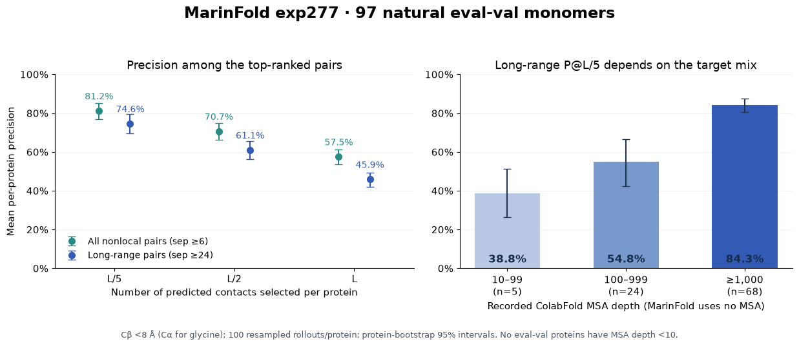

---
marinfold_experiment:
  issue: 352
  title: 'exp: eval-val contact precision and historical CASP context'
  kind: evals
  branch: main
---

# exp: eval-val contact precision and historical CASP context

**Issue:** [#352](https://github.com/Open-Athena/MarinFold/issues/352)

## Conclusion

The current default, **contacts-v1-exp277-m2-p06-full-epoch-1.5B, step 266344**, achieves **74.6% precision at L/5, 61.1% at L/2, and 45.9% at L** for long-range CASP-style contacts on the 97 natural eval-val monomers. This is well above typical contact-prediction accuracies reported in early CASPs and numerically in the range reported by leading late-2010s contact predictors. It does **not** establish that MarinFold would have won an earlier CASP or has equivalent 3D folding accuracy: the target sets, domains, information available, and evaluation setting differ.

The most concrete comparability warning is the target mix: **68/97 eval-val proteins have recorded MSA depth ≥1000; none have depth <10**. Long-range P@L/5 is 84.3% in the deepest tier and 38.8% in the five-protein depth-10–99 tier. MarinFold receives a single sequence, but homolog availability remains associated with how difficult that sequence is to predict. These observations support a strong contact-ranking claim on eval-val, not a historical free-modeling victory claim.

## Question and hypothesis

How accurate is the current default under standard top-L contact metrics, and what can we say relative to CASP4 (2000), CASP7 (2006), and later competitions? The hypothesis is that accuracy exceeds early contact-prediction performance, while changes in target composition prevent assigning a CASP rank from a different benchmark.

## Results

Values are percentages, averaged equally over proteins. Parentheses give 95% percentile bootstrap intervals from 20,000 protein resamples. L is the full input-sequence length. Each range is ranked separately.

| Contact range | P@L/5 | P@L/2 | P@L |
|---|---:|---:|---:|
| All nonlocal, separation ≥6 | **81.2 (76.9–85.2)** | **70.7 (66.1–74.8)** | **57.5 (53.5–61.3)** |
| Long, separation ≥24 | **74.6 (69.4–79.4)** | **61.1 (56.4–65.4)** | **45.9 (42.1–49.4)** |
| Medium, separation 12–23 | 55.8 (51.3–60.3) | 35.3 (32.2–38.5) | 22.2 (20.3–24.2) |
| Short, separation 6–11 | 54.3 (50.2–58.3) | 31.6 (29.3–33.9) | 19.2 (17.9–20.6) |

Short/medium bins contain fewer true contacts, so asking for L contacts in a narrow range can impose a substantial ceiling. These rows are not a ranking of intrinsic difficulty across ranges. For long-range pairs, the mean oracle ceiling is 100%, 99.8%, and 95.7% at L/5, L/2, and L. Uniform random ranking has mean precision **2.32%** across long-range candidate pairs; this is a prevalence baseline, not a competitive predictor.

At long-range L/5 the median protein scores **84.1%**, 82/97 score at least 50%, and 7/97 score below 20%. A good average does not imply uniform reliability.



### Target strata

| Subset | n | Long-range P@L/5, 95% CI |
|---|---:|---:|
| MSA depth 10–99 | 5 | 38.8% (26.3–51.2) |
| MSA depth 100–999 | 24 | 54.8% (42.2–66.6) |
| MSA depth ≥1000 | 68 | 84.3% (80.4–87.4) |
| Viral | 6 | 69.9% (51.3–85.1) |
| Nonviral | 91 | 74.9% (69.5–79.9) |

MSA depth is the recorded ColabFold alignment size from exp260, not Neff and not a model input. The viral split is too small for a precise estimate. The skill's frozen natural depth-<10 FoldBench subset is entirely in eval-test and has **zero** members here; its other natural members are legacy CASP/CAMEO targets. We did not score either set, or add designed proteins, to fill that gap. This eval-val-only analysis cannot measure the extremely shallow-MSA regime.

## Historical CASP context

These are **published contextual reference points on different target cohorts**, not predictions generated in this experiment. Different rows summarize different groups, as indicated; do not fit a performance trajectory through them or interpret them as one common leaderboard. Most historical summaries emphasize L/5; missing historical L/2 and L values are not inferred.

| Competition | Published contact precision | What the number means |
|---|---:|---|
| CASP4 (2000) | 10%; 20% at higher confidence | CIRB's roughly 2L submitted pairs; confidence >0.8 subset respectively. **Neither is P@L/5.** |
| CASP7 (2006) | 13% | Long-range P@L/5 averaged across specialist groups and 19 FM/FM-TBM targets. |
| CASP7 (2006), FM-only | 15.5% | SAM-T06 on the 15 FM domains; the best identified group on that particular subset. |
| CASP11 (2014) | 26.7% | Best-group long-range P@L/5 on FM targets. |
| CASP12 (2016) | 47.1% | Best-group long-range P@L/5 on FM targets. |
| CASP13 (2018) | approximately 70% | Leading long-range P@L/5 accuracy on FM targets. |
| CASP13 / CASP14 (2018 / 2020) | 65% / 64% | Top-five group averages on 31 / 22 FM domains. The assessors describe CASP14 as harder. |

Sources: CASP4 [Lesk et al., Tables V–VI](https://doi.org/10.1002/prot.10056), read through a [transcription of the original paper](https://doczz.net/doc/8621957/assessment-of-novel-fold-targets-in-casp4); CASP7 [Izarzugaza et al., Results and “Has there been progress?”](https://dspace.ceu.es/server/api/core/bitstreams/31c3bdcd-daaa-4e9b-a95e-00dd291ecb4a/content); CASP11–13 [Shrestha et al., improvement section and Fig. 4](https://escholarship.org/content/qt27n019dx/qt27n019dx_noSplash_72fd17ec94d1cb93d5e89edeb5edcc01.pdf); CASP13–14 [Ruiz-Serra et al., §3.1](https://escholarship.org/content/qt90f572sq/qt90f572sq.pdf). The machine-readable source table is [historical_context.csv](data/historical_context.csv).

The defensible statement is: **“On 97 natural eval-val monomers, MarinFold predicts 74.6% of its top L/5 long-range Cβ contacts correctly, far above the typical contact-prediction numbers reported in early CASP assessments.”** Add that this is a cross-benchmark comparison. The numerical proximity to late-2010s CASP results is context, not evidence of equal ability.

Reasons a stronger claim would fail:

- Historical contact assessments focused on hard free-modeling domains. Eval-val is a broad natural-monomer development set, with full-chain L and potentially interdomain contacts. We have no matched historical-difficulty classification.
- CASP predictions were prospective and blind; eval-val is repeatedly used for development. exp277's native and redesign sources were filtered by exp225's sequence-overlap rule, but sequence decontamination does not make these targets equivalent to historical novel folds or prove absence of remote structural relatives.
- MarinFold uses a modern, large training corpus of predicted structures, including ProteinMPNN redesigns. Historical methods had smaller databases, and many used MSAs/templates during inference. Single-sequence inference does not make their total available information comparable.
- Contact precision measures a ranked subset of residue pairs, not whether those pairs are globally consistent or can reconstruct an accurate fold. No 3D models, TM-scores, or GDT-TS scores were computed here.

## Our native metric and previous default

Changing the contact definition is material, especially at L. Under the existing **pyconfind** truth, long-range P@L/5 / P@L/2 / P@L are **75.8% / 58.8% / 39.0%**, versus **74.6% / 61.1% / 45.9%** with Cβ truth. The frozen pyconfind universe is preserved; Cβ truth is a separately labeled analysis. Never place the native pyconfind numbers on a CASP axis.

| Predictor, same eval-val pyconfind truth | Long P@L/5 | Long P@L/2 | Long P@L |
|---|---:|---:|---:|
| exp277 step266344, current default | 75.8% | 58.8% | 39.0% |
| exp232 step363000, previous default | 75.3% | 58.6% | 39.2% |
| Sequence-KNN, decontaminated native corpus | 57.6% | 43.8% | 29.7% |

The previous default is numerically very similar at these cuts. KNN is the existing exp245 null over the decontaminated native corpus, **not a newly computed null over exp277's full native-plus-redesigned mixture**. These comparisons reuse archived per-protein metrics and are not rescored with Cβ truth. Paired bootstrap differences are in `data/native_reference_deltas.csv`.

## Methods and validation

**Model and saved inference.** [Training W&B](https://wandb.ai/open-athena/MarinFold/runs/contacts-v1-exp277-m2-p06-full-epoch-1.5B), [published checkpoint](https://huggingface.co/buckets/open-athena/MarinFold/tree/checkpoints/contacts-v1-exp277-m2-p06-full-epoch-1.5B/hf/step-266344). Votes were read from `s3://marin-us-east-02a/MarinFold/exp277_models_single_mpnn_pilot/evals/rollout-v2/2026-09-13/v2-01/dense_scores/exp277_full_epoch_m2_p06_step266344/`, selecting **only** `foldbench_monomer` eval-val units. The recipe is 100 fresh document resamplings, temperature 1.0, top-p .95, top-k disabled, budget min(8192−prompt tokens, 6L+128), seed 0. All **9,700/9,700** selected rollouts finished. The original 670-unit run had one unfinished rollout outside this cohort. No inference or checkpoint transfer was needed. Source per-protein inference timings are preserved in `data/source_timings.csv`.

**CASP contacts.** First deposited model and the frozen ground truth's author chain, Cβ–Cβ distance <8 Å, Cα for glycine only. Every input sequence exactly matches the deposited canonical entity sequence. `label_seq_id` places coordinates into that sequence. Alternate atoms use greatest occupancy, then altloc. Residues lacking the required atom are excluded; no non-glycine Cα substitutes or inferred Cβ atoms. The strict versus inclusive 8 Å threshold changes no eligible pair in this cohort. Full-chain L sets floor(L/5), floor(L/2), and L; both residues must have coordinates. The candidate count never restricts the headline cuts on these 97 proteins.

**Ranking and statistics.** Descending final-live-contact rollout vote counts, then ascending residue pair (i,j), as in exp89 and the CASP7 assessment's residue-number secondary ordering. Unvoted pairs stay in the ranking; they occupy no top-L/5 or top-L/2 slots and a mean 0.28% of long top-L slots. Averaging random ordering within a boundary tie gives **74.61%** versus the deterministic **74.63%** at long L/5. Worst/best possible boundary-tie choices give 74.04–75.33%. Confidence intervals resample proteins, not pairs or rollouts: they omit training-seed, inference-resampling, and possible between-protein relatedness uncertainty. Strata are descriptive, not causal estimates of MSA benefit.

**Ground-truth audit.** Every one of the 1,940 archived pyconfind metric rows reproduces with maximum absolute error **1.11e−16**, and all candidate/positive/top counts match exactly. This control uses unmodified exp89 `compute_metrics.py`. The distance analysis reports a separate universe rather than overwriting frozen truth. Eight proteins have differences between deposited polymer positions and the older resolved-position set: 7pv5_A, 7x8l_A, 7xyr_A, 8adc_A, 8add_A, 8b2s_A, 8b5w_A, 8ec3_A. These include modified/backbone-incomplete residues and ambiguous repeated-residue gap alignments. Details and every CIF/matrix digest are in `data/coordinate_audit.csv`. Restricting Cβ scoring to the common position universe leaves long P@L/5 unchanged; excluding all eight gives 75.6% on 89 proteins. Nothing was silently skipped.

The independent unit checks cover exact 8 Å boundaries, missing coordinates, sequence separation, ties, and zero-vote ranking. No eval-test predictions or historical CASP target predictions were computed or assessed.

## Reproduction and artifacts

From this experiment directory:

```bash
uv sync
uv run python analyze.py
uv run python references.py
uv run python plot_results.py
uv run python build_summary.py
uv run pytest -q test_metrics.py
```

`analyze.py` downloads the 2.55 MB frozen input bundle anonymously on first use. Inputs include only eval-val votes, native truth, selected CB/CA coordinates, sequence and chain provenance, and artifact hashes. Initial collection used `uv run python prepare_inputs.py`; this optional collection path needs the existing CoreWeave `cw` profile and downloads only the 97 selected vote matrices. `publish_to_hf.py` uploads and verifies all artifacts anonymously.

Public artifacts: [HF bucket](https://huggingface.co/buckets/open-athena/MarinFold/tree/data/exp352-casp-precision-context/v1). Small per-protein tables, aggregates, audit records, source timing records and [summary PDF](plots/summary.pdf) are also committed here. Input and source hashes, recipe, and cohort membership are in `data/provenance.json`; historical source definitions are in `data/historical_context.csv`. No new W&B run was created because this is analysis of archived predictions.
