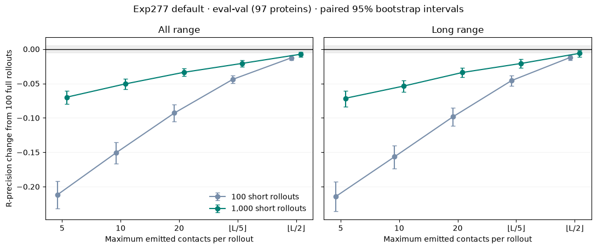

---
marinfold_experiment:
  issue: 354
  title: 'exp: 1000 short-rollout consensus versus 100 full rollouts on eval-val'
  kind: evals
  branch: main
---

# exp: 1000 short-rollout consensus versus 100 full rollouts on eval-val

**Issue:** [#354](https://github.com/Open-Athena/MarinFold/issues/354) · **Kind:** `evals`

## Question

Does the current default contacts-v1 model improve on eval-val when consensus uses 1,000 short rollouts capped at 5, 10, 20, floor(L/5), or floor(L/2) emitted contacts, instead of 100 full rollouts?

## Hypothesis

More independent resampled prefixes might improve consensus by reducing correlations within each rollout, but very small contact budgets might lose useful conditional information.

## Approach

The model is the live registry default `contacts-v1-exp277-m2-p06-full-epoch-1.5B`, step 266344. Both the checked-out registry and live GitHub registry were verified. We scored exactly the 97 natural eval-val proteins from #245, length 38–761; eval-test and eval-denovo were not evaluated.

Every trajectory uses a fresh deterministic contacts-v1 document realization, with randomized N-terminus and sequence-statement order. Sampling uses temperature 1, top-p 0.95, top-k disabled, and natural early EOS. The full baseline uses the established 6L+128 token guard. All arms use the identical #89 resolved-residue candidate universe and metric implementation, with minimum sequence separation six, live contacts only, one vote per pair per rollout, and no pairwise tie-break.

We generated 1,000 trajectories through max(20, floor(L/2)) complete emitted contact statements and extracted each shorter prefix at its exact contact boundary. Duplicate or invalid contact statements spend the generation budget but receive no duplicate or invalid votes; retractions update the live set before the cutoff. We also scored the first 100 short trajectories as controls. A separate fresh 100-full-rollout generation provides the primary baseline. Seeds are deterministic by protein and rollout; the short arms share trajectories, while the full arm is a separate generation.

All protein-level comparisons use macro means. Paired bootstrap intervals resample the 97 proteins, with 20,000 draws and seed 354. The 99% per-comparison intervals provide a Bonferroni adjustment for the five prespecified 1,000-rollout caps within a distance range. Secondary metrics and subgroup comparisons are exploratory.

## Success criteria

A gain of at least 0.005 all-range R-precision over the fresh full baseline, with paired uncertainty reported. Report all five caps and all/long precision; keep AUC as a ranking diagnostic.

## Results

**No short-rollout setting improved contact precision.** The best short setting, 1,000 rollouts capped at floor(L/2), scored **0.55003 all-range R-precision**, below **0.55743** for 100 full rollouts. Its paired difference was **−0.00740 [−0.01094, −0.00396]** (95% CI), with 19 protein-level wins, 59 losses, and 19 ties. The 99% interval also excludes zero. Long-range R declined from 0.54149 to 0.53534, a difference of −0.00615 [−0.01105, −0.00145].

| Setting | All-range R | Long-range R | All-range AUC |
|---|---:|---:|---:|
| 100 full rollouts | 0.55743 | 0.54149 | 0.93921 |
| 1,000 × 5 contacts | 0.48759 | 0.47001 | 0.88301 |
| 1,000 × 10 contacts | 0.50686 | 0.48784 | 0.91032 |
| 1,000 × 20 contacts | 0.52369 | 0.50752 | 0.93036 |
| 1,000 × ⌊L/5⌋ contacts | 0.53671 | 0.52061 | 0.94668 |
| 1,000 × ⌊L/2⌋ contacts | 0.55003 | 0.53534 | 0.95565 |

| Cap (1,000 rollouts) | Δ all-range R | Paired 95% CI | Paired 99% CI |
|---|---:|---|---|
| 5 contacts | -0.06984 | [-0.07962, -0.06053] | [-0.08271, -0.05760] |
| 10 contacts | -0.05057 | [-0.05794, -0.04352] | [-0.06022, -0.04136] |
| 20 contacts | -0.03374 | [-0.03953, -0.02811] | [-0.04139, -0.02641] |
| ⌊L/5⌋ contacts | -0.02072 | [-0.02569, -0.01598] | [-0.02731, -0.01455] |
| ⌊L/2⌋ contacts | -0.00740 | [-0.01094, -0.00396] | [-0.01208, -0.00289] |

The fresh full baseline is +0.00368 all-range R and +0.00348 long-range R above #277's published first-epoch evaluation (0.55375 / 0.53802), within the repository's 0.005 tie threshold. This is a sanity check against the historical execution path; the table's comparisons all use the fresh baseline from this run.

There is a real **AUC improvement** for the larger short caps. At floor(L/2), all-range AUC rose from 0.93921 to 0.95565, +0.01643 [0.01281, 0.02040], and long-range AUC rose from 0.92872 to 0.94849. Thus the ranking across the full candidate universe improves while precision among the highest-ranked contacts worsens. Precision at L, L/2, and L/5 was also lower for every 1,000-short setting than for 100 full rollouts, in both all and long ranges; exact values are in `data/summary.csv`.

Increasing the short sample count helps, but does not recover the full baseline. For example, all-range R for the L/2 cap rises from 0.54481 at 100 samples to 0.55003 at 1,000. At the five-contact cap it rises from 0.34566 to 0.48759. These controls support keeping more of each trajectory for precision; they do not identify why late contacts help or predict the outcome of 1,000 full rollouts.

### Cost and completeness

All **97,000 short trajectories and 9,700 full trajectories** were usable, with zero full rollouts hitting the token guard. Short trajectories could end naturally before their cap: the L/2 arm had 1,421 early EOS events out of 97,000; the 20-contact arm had 105. Every requested sample was retained, including early EOS.

The shared short generation through max(20, L/2) took **1,499.5 seconds (25.0 minutes)** of pure generation, versus **416.4 seconds (6.9 minutes)** for 100 full rollouts on the same GB200: **3.60×**. The L/2 scores used 39.38 million output tokens versus 7.90 million for full rollouts, **4.98×**, and 1,000 samples also require ten times as many prompt tokens. Smaller-cap output budgets are recorded in `data/sampling_summary.csv`. Per-cap standalone runtimes are unmeasured: the short rows' `timing_scope` explicitly identifies the shared generation. Model staging/loading and total per-protein execution are recorded separately in `data/timings.csv`.

The raw-sample audit reconstructed and matched **all 1,067 vote matrices**. It verified trajectory counts, exact contact cutoffs, EOS accounting, and a single worker/checkpoint/runtime identity. No generated token was outside the 2,000-position contacts-v1 ring; the parser explicitly rejects the tokenizer's extra position tokens. See `data/artifact_audit.json`.

### Reference and subgroup checks

The published decontaminated-corpus sequence-KNN reference is 0.40715 all-range R / 0.39211 long-range R on these 97 proteins, reused from #245. It is context for the model's absolute score, not a new KNN run over the redesign-augmented training corpus.

For the six viral proteins, full versus L/2-short all-range R was 0.49336 versus 0.48260; for the 91 non-viral proteins it was 0.56165 versus 0.55448. Both point estimates favor full rollouts; the viral subset is small. Every arm and range is in `data/viral_split.csv`. No eval-val protein belongs to #260's frozen low-MSA-depth set, so that cut has coverage zero here; no extra eval sets were read to fill it.

## Reproducibility and artifacts

Production ran successfully as [`/bizon/exp354-gb-v1-20261009-production-00`](https://iris.oa.dev/#/job/%2Fbizon%2Fexp354-gb-v1-20261009-production-00), on one GB200 in `cw-us-east-08a`, using vLLM 0.11.0, Transformers 4.57.0, bfloat16 inference, and MarinFold revision `d1bea417a64cc042ad931422200c3edeb873f2e0`. `data/runtime.json` records the package versions and resolved ARM64 image manifest. Model identity was verified against #277's pinned S3 object sizes and ETags; tokenizer and input digests are recorded. A prior local real-protein smoke is documented separately and excluded from these results.

The exact checkpoint is `s3://marin-us-east-02a/MarinFold/exp277_models_single_mpnn_pilot/runs/contacts-v1-exp277-m2-p06-full-epoch-1.5B/hf/step-266344/`. Working outputs are under `s3://marin-us-east-02a/MarinFold/exp354_evals_short_rollout_consensus/gb-v1-20261009/production/`.

The [public HF artifacts](https://huggingface.co/buckets/open-athena/MarinFold/tree/data/exp354-short-rollout-consensus/gb-v1-20261009) contain `production/complete/` (per-protein metrics/timings), `production/scores/` (all arms' symmetric vote matrices), and `production/traces/` (raw token IDs and EOS flags), plus the analysis tables and plots. Small CSVs and the summary PDF also live in this directory.

`submit.py` builds the verified eval-val-only bundle and launches GPU jobs; `submit_export.py` and `export_results.py` publish their artifacts. After downloading the public production prefix to `scratch/exp354/production/` at the repository root, run `audit_results.py --results ../../scratch/exp354/production` and `analyze.py --results ../../scratch/exp354/production` from this experiment directory with `uv run python`. `build_summary.py` regenerates the PDF from the saved narrative and plot, and `publish_to_hf.py` publishes the report. Parser boundary tests run with `uv run pytest -q test_contacts.py`.

## Conclusion

For this default model on eval-val, **keep 100 full rollouts when optimizing contact precision**. None of the five 1,000-short configurations improved R-precision or precision at L/L2/L5. The largest short cap came closest but remained slightly worse and took more generation time. Larger short ensembles do improve AUC, so they may be useful if global ranking is the objective; that diagnostic gain is not a top-contact precision gain. These are results for one sampling seed and this validation set, not a held-out confirmation.
