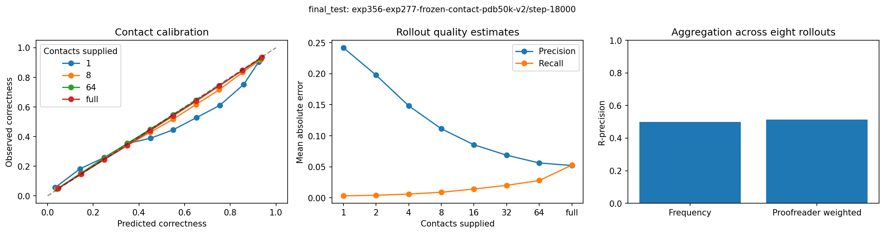

---
marinfold_experiment:
  issue: 356
  title: 'exp: bidirectional proofreading of MarinFold rollouts on experimental PDB structures'
  kind: models
  branch: codex/exp356-proofreader
---

# exp: bidirectional proofreading of MarinFold rollouts on experimental PDB structures

**Issue:** [#356](https://github.com/Open-Athena/MarinFold/issues/356) · **Kind:** `models` · **Branch:** `codex/exp356-proofreader`

## Question

Can a model identify incorrect contacts in actual MarinFold rollouts using all supplied evidence, from a single contact through a complete rollout, and estimate current precision and recall?

## Hypothesis

Pretrained contact-language features and a bidirectional readout can identify inconsistent contacts, including cases where later evidence changes an earlier judgment. Supervision from experimental structures can also teach rollout-level quality estimates.

## Approach

The selected architecture freezes the current default generator's exp277 step-266344 causal Qwen3 backbone. A four-layer, 512-wide, eight-head bidirectional transformer reads the three token states for each contact, its emission-order embedding, and a global token derived from the prompt boundary, final supplied token and prefix-size features. It has 22,181,378 trainable parameters and 1,487,731,202 total parameters. A shared sigmoid head predicts each contact's correctness; mean probabilities over distinct proposed pairs estimate precision, and a pooled sigmoid head estimates recall.

Inputs are actual generator prompts and rollouts, physically cropped before encoding. Training samples 25% complete rollouts, 25% short prefixes of 1/2/4/8 contacts and 50% uniformly sampled prefix lengths. Binary cross-entropy supervises contacts and squared error supervises recall. The generator uses temperature 1 and top-p 0.95. No reference labels or unseen continuation enter model inputs. Explicit evaluation prefixes exclude later end markers even when their last contact is the last generated contact.

## Data

Training contains 50,000 experimental PDB chain structures from 46,933 PDB entries, with 34,894 distinct supplied sequences in 9,074 connected related groups. Validation contains 1,552 structures in 287 groups; the reserved test contains 1,473 structures in 295 groups. Structures range from 32 to 1,000 supplied residues. Related PDB entries, exact sequences and homology groups remain together; explicit cross-split searches and benchmark-homolog exclusion check separation.

Inputs contain only observed residues: the canonical sequence or one unique contiguous segment covering at least 90%, with no more than 20 omitted residues at either terminus. Internal gaps are rejected. References are complete exp222 native-only pyconfind contact sets (3 Å side-chain threshold, minimum contact degree 0.001, sequence separation at least six). Recall's denominator is the complete reference set for the supplied sequence.

All 32 CoreWeave generation shards completed. The audit checks raw token-to-contact alignment, reference labels, duplicates, provenance and target coverage. Of 424,200 requested trajectories, 423,371 were retained, including 399,213 training trajectories and 109,251,347 contact labels across all splits. It excludes 703 malformed and 126 empty trajectories; every target retains usable data. Incorrect and invalid proposed contacts remain negative examples. Counts, sequence mappings and experimental methods are recorded in `data/`.

## Training and selection

The [production run exp356-exp277-frozen-contact-pdb50k-v2](https://wandb.ai/open-athena/MarinFold/runs/exp356-exp277-frozen-contact-pdb50k-v2) completed three epochs, 18,714 optimizer steps at global batch 64, on eight CoreWeave H100 GPUs. The head learning rate starts at 0.0002, with 200 warmup steps and cosine decay. All training examples are visited each epoch. Model, tokenizer and optimizer files are committed before recovery pointers advance.

The frozen-backbone architecture outperformed full-backbone bidirectional fine-tuning at matched step 2,000 on all validation structures: full-rollout AUROC 0.763 versus 0.728 and Brier 0.167 versus 0.188, while training about four times faster. That comparison selected the architecture; the original fine-tuning run stopped after its durable step-3,000 checkpoint.

The predeclared final candidate pool comprises retained step 7,500, the best fixed-sample validation checkpoint at completion, and the final checkpoint. Full validation selects **step 18000**, minimizing the equal mean across eight prefix lengths of protein-mean contact BCE plus recall squared error (objective 0.431166). `data/release_selection.json` was committed before the reserved test ran. No post-hoc calibration is applied.

Storage stalls required three recoveries near the end of training. Saved optimizer cursors reproduced validation and replayed training metrics exactly. The complete local step-17,000 checkpoint was salvaged through the same-region object-store origin; connection renewal and bounded uploads then allowed training to finish. Run history and dispatch/recovery records contain the job IDs and evidence. The shared cluster was not restarted.

## Reserved test results

These results cover all 1,473 reserved structures and 295 related groups. Values first average rollouts within each protein, then proteins. Confidence intervals in the JSON reports use 1,000 bootstrap replicates over entire related groups. Full-rollout mean within-rollout AUROC is **0.7933**; AUROC excludes rollouts with only one reference class.

| Contacts supplied | Contact Brier | Precision MAE | Recall MAE |
| --- | ---: | ---: | ---: |
| 1 | 0.1350 | 0.2419 | 0.0032 |
| 2 | 0.1330 | 0.1978 | 0.0042 |
| 4 | 0.1318 | 0.1483 | 0.0061 |
| 8 | 0.1322 | 0.1113 | 0.0090 |
| 16 | 0.1333 | 0.0855 | 0.0142 |
| 32 | 0.1356 | 0.0687 | 0.0201 |
| 64 | 0.1376 | 0.0562 | 0.0279 |
| full | 0.1438 | 0.0521 | 0.0528 |

Later evidence improves the first contact's Brier score by **0.0067** at 64 contacts (95% interval 0.0047–0.0088), among eligible rollouts, without access to a later end marker. Full-rollout context improves it by 0.0066.

Keeping the highest-scored half of contacts yields precision **0.5788**, compared with 0.4019 for the first half in emission order. Selecting one rollout by estimated precision gives 0.4504, versus 0.4033 for a random rollout. Probability-weighted aggregation R-precision is 0.5135, versus 0.4987 for frequency alone.

## Released artifacts and verification

The [production checkpoint](https://huggingface.co/buckets/open-athena/MarinFold/tree/checkpoints/exp356-exp277-frozen-contact-pdb50k-v2/step-18000) includes the frozen backbone, trained readout, tokenizer, inference code, pinned dependencies, model card and SHA256 manifest. The model card documents the raw-rollout and sequence-plus-contact-list inference interfaces. [Audited rollouts and targets](https://huggingface.co/buckets/open-athena/MarinFold/tree/data/exp356/rollouts-v1) and [reports, per-rollout tables, timings and provenance](https://huggingface.co/buckets/open-athena/MarinFold/tree/data/exp356/reports) are public and anonymously readable. Working artifacts remain under `s3://marin-us-east-02a/MarinFold/exp356/`.

Twenty-one tests cover attention behavior, padding, frozen gradients, crop boundaries, duplicate accounting, checkpoint round-trips, retention and release selection. Single- and eight-GPU smoke runs exercised optimizer recovery. Independent anonymous download and shipped-inference verification is the remaining release check. Its predictions and contemporaneous timing ledgers will accompany the reports. `plots/summary.pdf` combines the narrative and reproducible figures.

Early reports remain available as experiment history. Before the explicit-prefix boundary fix, 75 of 12,394 validation rollouts matched a measured final-contact boundary and included the later end marker. Full-rollout metrics are unchanged; final selection and test reports use the corrected boundary policy.

## Conclusion

The released model performs contextual contact proofreading and estimates precision and recall from variable-length actual MarinFold rollouts. Later contacts measurably improve earlier judgments, and the scores improve contact and rollout selection. The reported scope is single-chain exp277 rollouts for 32–1,000 residues at the evaluated sampling settings. These are held-out structures for proofreader training; absence from the pretrained generator's corpus is not established. Other generators, complexes, edited trajectories and lengths outside this range remain unvalidated. Experimental-reference correctness does not establish physical impossibility in another conformation.
