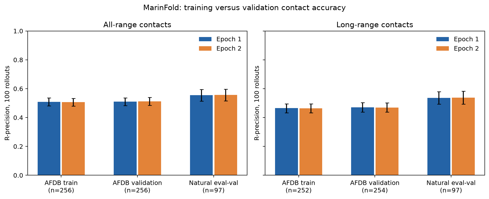
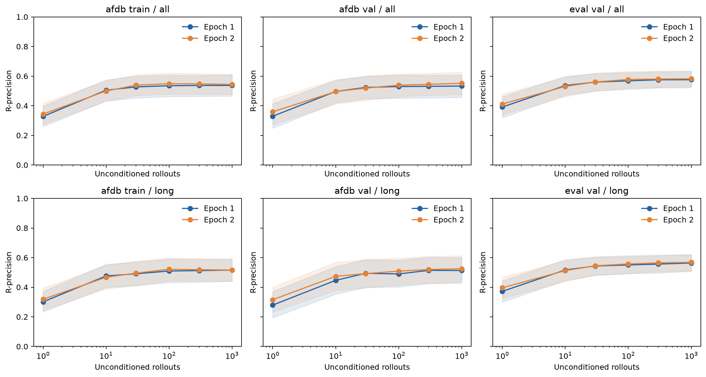
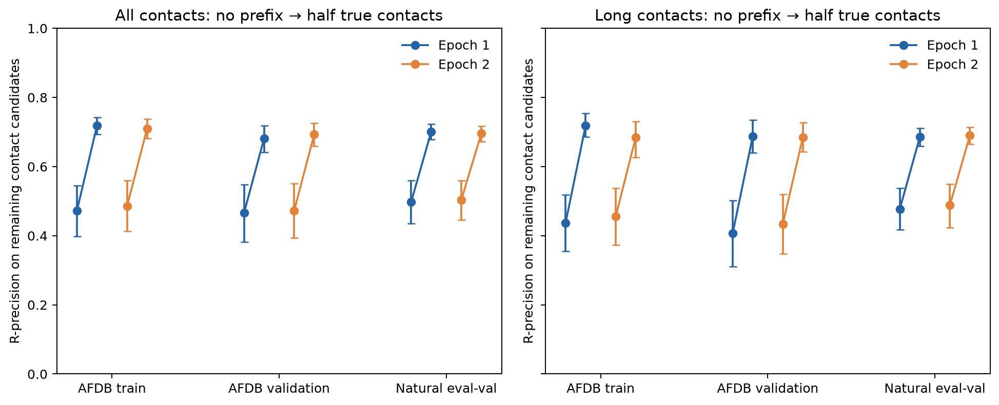

---
marinfold_experiment:
  issue: 357
  title: 'exp: diagnose training versus AFDB validation contact accuracy'
  kind: evals
  branch: exp357/train-val-rprecision
---

# exp: diagnose training versus AFDB validation contact accuracy

**Issue:** [#357](https://github.com/Open-Athena/MarinFold/issues/357) · **Kind:** `evals` · **Branch:** `exp357/train-val-rprecision`

## Question

Does MarinFold predict contacts much more accurately on actual training proteins than on the original contacts-v1 AFDB validation split and natural FoldBench eval-val? Do additional training or inference samples improve R-precision enough to distinguish memorization, limited inference, and undertraining?

## Hypothesis

Keep three explanations separate: a large matched AFDB train-minus-validation gap supports overfitting; similar low train/validation scores show that training contacts are not nearly perfectly reproduced but do not distinguish optimization, capacity, labels, or inference; gains from more rollout samples or true partial-contact conditioning support an inference/conditioning limitation. A second-epoch checkpoint directly tests one available increase in training exposure, not all possible training recipes.

## Background

- #277 supplies the current default at step 266344 and a continuation at step 479417. Both checkpoints and the training caches already reside in CoreWeave object storage.
- #53 supplies the original contacts-v1 AFDB train/validation split. #225 removed evaluation homologs from training; #266 adds redesigns of retained training backbones.
- #163 measured actual training proteins only for an older checkpoint and pairwise scorer; those numbers cannot answer the current question.
- #82/#89 define rollout voting and contact R-precision. #245 supplies the 97 natural eval-val proteins; eval-test remains unread.

## Approach

1. Freeze 256 native AFDB training proteins actually retained in exp277 and 256 original AFDB validation proteins. Audit source documents, split provenance, duplicate sequences/clusters, and train membership. Use deterministic sampling and report length, confidence, contact density, and pLDDT-round distributions; provide matched/stratified comparisons. Clearly distinguish the original AFDB holdout from homology-free holdout against all later corpora.
2. Evaluate both exp277 checkpoints on these samples and the 97 natural eval-val proteins using the canonical 100-rollout recipe, common prompt realizations/seeds, exact exp89 candidate/metric implementation, and the document's training contact labels for AFDB. Reproduce existing eval-val scores as the execution gate.
3. Save per-rollout contacts and termination diagnostics. Report R-precision at nested rollout budgets and single-rollout F1/precision/recall separately. On a frozen smaller subset of each cohort, extend to 1000 rollouts and condition on a random half of true contacts. For the latter, score only the remaining contacts with the supplied pairs removed from the candidate universe, alongside the unconditioned prediction on the identical reduced task. Oracle conditioning is diagnostic and never a deployable score.
4. Use same-region CoreWeave compute and existing checkpoints, batch-priority independent H100 shards, per-input timing/worker metadata, and durable resumable outputs. No cross-region checkpoint mirror or new training run is needed.
5. Report per-protein macro R-precision, all/long bands, bootstrap intervals, training-exposure and inference-budget deltas, completeness, and limitations. Publish small CSVs/plots and a summary PDF through a PR; publish large artifacts to the public MarinFold bucket.

## Success criteria

A reproducible three-cohort R-precision comparison that directly answers whether native AFDB training accuracy is very high, quantifies any train/validation gap, and separates measured effects of additional training/inference from hypotheses. Differences below 0.005 are treated as ties. A null or inconclusive diagnostic is a valid result.

## Frozen protocol

The first checkpoint is `contacts-v1-exp277-m2-p06-full-epoch-1.5B`, step 266344.
The continuation is `contacts-v1-exp277-m2-p06-full-epoch2-from213072-1.5B`,
step 479417. The latter restores full state from step 213072, immediately before
the original cooldown, and adds a fresh shuffled pass with its own cooldown.
The intervention changes training exposure and schedule together. The exact
same-region S3 exports, file sizes, and pinned ETags are in `data/checkpoints.json`.

`prepare_inputs.py` freezes 256 native training proteins from 64 seeded randomly
selected shards of the 2067-shard decontaminated AFDB training corpus. It chooses
one representative per structural cluster and exact sequence. Validation
candidates cover all 22 original AFDB validation shards. Greedy matching uses
the exact confidence-selection round, log length, and global pLDDT. Eligible
AFDB documents have 30–1000 residues, at least five contacts, and no truncation;
their serialized contacts must round-trip exactly. This is a sample of native
AFDB backbones, not an estimate over the entire native/MPNN/ESM training mixture.

| Cohort | Proteins | Mean length | Median length | Mean pLDDT |
|---|---:|---:|---:|---:|
| AFDB train | 256 | 249.68 | 200.5 | 85.377 |
| Original AFDB validation | 256 | 249.80 | 199.5 | 85.384 |
| Natural FoldBench eval-val | 97 | 271.40 | 245.0 | — |

AFDB round 0–4 counts are identical in both cohorts: 60, 55, 43, 52, 46.
The coordinator verifies all 256 training document hashes against the actual
exp232 S3 AFDB files used by exp277. The original AFDB split separates structural
clusters, but it was **not** decontaminated against all later ESM corpus additions.
Therefore AFDB validation is the original corpus holdout, not a certified
homology-free holdout of the final mixture. AFDB labels are the exact original
predicted-structure training contacts; FoldBench labels come from experimental
structures. Their scores are not interchangeable measures of generalization.

All 609 proteins receive 100 fresh exp82-style prompts per checkpoint:
temperature 1, top-p 0.95, top-k disabled, output cap `min(8192 - prompt_tokens,
6L + 128)`, bf16 vLLM 0.9.2 on H100. Prompt realizations and sampling seeds are
shared across checkpoints. `data/code_manifest.json` identifies the exact
submitted code, including a wheel built from MarinFold revision
`d1bea417a64cc042ad931422200c3edeb873f2e0`. Sampling seeds are stable by protein
and rollout rather than by worker batch. Only terminated samples vote; all
termination counts remain visible. Contact parsing respects retractions.

R-precision is the fraction of true contacts among the top R ranked candidate
pairs, where R is the true contact count for that protein and range. The unchanged
exp89 metric defines resolved candidates, degree threshold 0.001, all-range
sequence separation at least 6, and long-range at least 24. Scores are macro
averages over proteins with defined R. We retain the reference stable handling
of vote ties. Random ranking has expected R-precision equal to contact density;
`data/random_rprecision.csv` reports that context.

For each cohort, 32 proteins are chosen before inference for extended diagnostics.
Their unconditioned budget is 1000, with nested results at 1, 10, 30, 100, 300,
and 1000 samples. They also receive 100 samples conditioned on a fixed random
half of true contacts. Supplied contacts are removed from the candidate universe
for both the oracle and unconditioned comparator, so copying the prefix cannot
earn credit. Prefix contacts are serialized in canonical pair order. This oracle
task changes the available information and is not a deployable performance score.
Single-sample set precision, recall, and F1 are saved separately from R-precision.

Uncertainty uses 5000 protein bootstrap replicates. Training-versus-validation
deltas use the predefined matching pairs; checkpoint, budget, and oracle deltas
are paired within protein. These intervals capture variation across sampled
proteins, not training-seed uncertainty. Length, confidence, and selection-round
strata, score distributions, and complete-protein sensitivity are included.
Shared sampling seeds do not guarantee bitwise-identical GPU outputs. The
independent smoke/production repeat on `7y5j_A` had identical 100-rollout all/long
R-precision for both checkpoints, despite differences in individual sampled
sets; the full repeatability record is in `data/repeatability.json`.

## Execution and reproducibility

`prepare_inputs.py` creates the frozen inputs; `submit.py` bundles a regional
coordinator; `driver.py` verifies sources and gates the full 24-worker run on
two successful H100 smoke jobs. All checkpoint reads and working outputs remain
in CoreWeave `cw-us-east-02a`. Each worker writes raw samples and a completion
marker per protein, allowing exact resumption without silently dropping failures.
`fetch_results.py` refuses partial headline results. `analyze.py` computes tables
and plots; `build_summary.py` assembles the existing plots and narrative into PDF.
`publish_to_hf.py --submit` exports raw outputs from the regional working copy.

Working output: `s3://marin-us-east-02a/MarinFold/exp357_evals_train_val_rprecision/v1/`.
Public output: `hf://buckets/open-athena/MarinFold/data/exp357-train-val-rprecision/v1/`.
The public archive retains every raw rollout, compact tables, inputs, and SHA256
artifact manifest. No eval-test scores are produced or inspected.

The initial coordinator `/bizon/exp357-v1-a01` hit the Linux argument-size limit
before inference. `/bizon/exp357-v1-a02` uses a regional S3 code bundle and the
same frozen protocol. Its [Iris dashboard](https://iris.oa.dev/#/job/%2Fbizon%2Fexp357-v1-a02)
provides the run record. Unit checks cover training-document round trips,
position rotations, retractions, capped samples, nested budgets, and exclusion
of supplied oracle contacts. The final eval-val reproduction gate compares both
checkpoints against their existing exp277 all/long R-precision, tolerance 0.005.

To reproduce locally, run `uv sync --frozen` in this directory. Restore
`data/targets.json` from the published `v1/inputs/targets.json` (or regenerate
with `uv run --frozen python prepare_inputs.py` and compare the frozen hashes).
Build the wheel by extracting `marinfold/` from the pinned git revision into
`scratch/vendor/`, then running `uv build --wheel --out-dir scratch/wheels
scratch/vendor/marinfold`. The launcher is `uv run --frozen python submit.py
--run-id <new-run-id> --attempt a01`; use a new run ID for changed inputs or
inference semantics. Local cluster access uses the workstation's existing Iris
installation and CoreWeave profile, as recorded in the scripts.

After completion, run `uv run --frozen python fetch_results.py --run-id <run-id>`,
`uv run --frozen python integrate_cap_checks.py`, `uv run --frozen python analyze.py`,
and `uv run --frozen python build_summary.py`.
The matched tables and figure scripts also run from the public inputs and results
without cluster access. `submit.py --repair <checkpoint-job-label>:<shard>`
retries one shard using the already-staged inference bundle;
`submit.py --collect-only` validates and consolidates all expected outputs after
an isolated recovery. Neither option changes prompts, labels, or seeds.

`data/timings.csv` records pure inference time separately for each input and mode,
with setup time and worker metadata. Its `total_seconds` is the complete
per-protein wall time (including both modes where applicable), plus model setup;
that shared total is repeated on both mode rows and must not be summed as job cost.
`data/headline_per_protein.csv` retains the individual all/long R-precision values
behind the main table; the public full metric CSV additionally contains all
sample budgets, ranges, and precision cuts.

Three original rollouts reached the `6L+128` cap: current-checkpoint `8dqd_A`
rollout 859, continuation-checkpoint `8adc_A` rollout 974, and continuation
training protein `AF-A0A1X7SGC0-F1` rollout 85. The first two are outside the
100-rollout headline; the third leaves 99 terminated votes in the original
continuation training evaluation. The exact records are preserved in
`data/capped_rollouts.json`. A separate `v1-capcheck` run repeats all samples of
these three units with the full remaining context (`8192 - prompt_tokens`),
using the same prompts, seeds, checkpoint files, and sampling knobs.

`integrate_cap_checks.py --fetch` verifies the rechecks and substitutes only those
three units, preserving the original CSVs. The final analysis reads the corrected
tables and requires zero unfinished samples. For an offline rebuild, the committed
`data/cap_checks.json` is sufficient: run `integrate_cap_checks.py` without `--fetch`
after restoring the original public result CSVs. The recheck raw outputs and
code bundle live under the public `v1-capcheck/` prefix; the original `v1/` archive
remains intact. `data/cap_check_deltas.csv` exposes every affected metric change.
All three rechecks finished without a capped sample. Applying them changes no
headline cohort mean by as much as **0.02 percentage points**. The final table
contains 313,800 terminated samples across all 1,218 protein/checkpoint units;
the rechecks required 2,300 additional generations beyond the original run.
Both checkpoints reproduce previous eval-val all/long R-precision within
**0.1 percentage points** (the configured tolerance was 0.5 points).

The shard-5 startup port collision was recovered by
`/bizon/exp357-v1-repair05`. `/bizon/exp357-v1-collect` completed the audited
collection at 2026-10-09 21:28:28 UTC. The original coordinator was cancelled only
after every expected output was durable, preventing its failed child from
triggering a redundant restart. `/bizon/exp357-v1-capcheck-a01` ran the three
full-context checks; `/bizon/exp357-export-v1` published the original archive.
The final report and corrected full metric table are published under
[`v1/report/`](https://huggingface.co/buckets/open-athena/MarinFold/tree/data/exp357-train-val-rprecision/v1/report).

## Results

**MarinFold is not substantially more accurate on these training proteins.**
The current checkpoint reaches about 51% all-range R-precision on both the
native AFDB training sample and its matched original AFDB validation sample.
The natural FoldBench eval-val mean is slightly higher, about 55.5%.

| Cohort | Current: all | Current: long | Continuation: all | Continuation: long |
|---|---:|---:|---:|---:|
| AFDB training | 50.9% | 46.5% | 50.7% | 46.4% |
| Original AFDB validation | 51.0% | 47.0% | 51.3% | 47.0% |
| Natural eval-val | 55.5% | 53.7% | 55.7% | 53.9% |

All-range denominators are 256, 256, and 97. Long-range denominators are 252,
254, and 97 because proteins with no true long-range contacts have undefined R.
The matched current-checkpoint train-minus-AFDB-validation difference is
**−0.12 percentage points**, with a 95% bootstrap interval of **[−4.13, +3.83]**.
There is no observed training advantage; this sample does not rule out a smaller
advantage within that interval. Only **1/256** current-checkpoint training
proteins reaches 90% all-range R-precision, and **0/256** reaches 95%.

The additional training pass changes all-range R-precision by less than
0.3 percentage points in each cohort. All paired intervals include zero;
these are practical ties under the 0.005 R-precision criterion. This particular
increase in training exposure does not improve either training reconstruction
or validation accuracy meaningfully.

### Sampling budget and partial-contact conditioning

On the fixed 32 diagnostic proteins per cohort, increasing from 100 to 1000
rollouts produces small all-range gains for the current checkpoint: about
0.2 points on training proteins, 0.3 on AFDB validation, and less than one point
on eval-val. Long-range gains are somewhat larger: approximately 0.6, 2.3, and
1.3 points. More samples help some cases, but the tenfold budget does not bring
the model close to reproducing all training contacts.

Supplying a random half of the true contacts has a much larger effect:

| Cohort, 32 proteins each | No supplied contacts, remaining-task R | Half true contacts supplied, remaining-task R | Gain |
|---|---:|---:|---:|
| AFDB training | 47.2% | 71.8% | +24.6 points |
| AFDB validation | 46.6% | 68.2% | +21.6 points |
| Natural eval-val | 49.8% | 70.1% | +20.3 points |

Both columns use 100 rollouts and the identical reduced candidate universe;
supplied pairs cannot earn credit. All three paired gain intervals exclude
zero. The continuation checkpoint shows similarly large gains. These scores
demonstrate useful conditional structure modeling. They do **not** show that
sequence-only inference can recover the supplied information, nor do they prove
that autoregression imposes an inherent accuracy ceiling.

Length-stratified AFDB training means remain around 50–54%, without a hidden
near-perfect short-protein regime. The per-protein distributions, confidence
and selection-round strata, paired intervals, and contact-density nulls are
available in `data/`. AFDB labels are predicted structures while FoldBench
uses experimental labels; the cohort ranking should not be interpreted as a
controlled comparison of label sources.

## Conclusion

The results do not support the hypothesis that MarinFold has nearly memorized
native AFDB training proteins and fails mainly on validation proteins. Training
R-precision is about 51%, essentially the same as matched AFDB validation.

They also do not support the simple explanation that this model merely needs
one more similar pass through the existing corpus: that intervention is flat
on both training and validation. The small gains from ten times as many
rollouts argue against ordinary Monte Carlo sample count being the dominant
limitation. The much larger oracle-conditioning gains show that the model can
use structural context substantially better than it can recover it from sequence
alone. Missing learned sequence-to-structure information, capacity, objective
alignment, optimization, and inference/readout remain possible explanations.

This experiment does not establish that autoregressive contact prediction is
necessarily inaccurate. A stronger next diagnostic would train a small fixed
protein set until contact R-precision itself saturates, comparing exact training
serializations and fresh prompt realizations. That proposed follow-up has not
been run here. The present conclusions apply to this native AFDB sample and
these two checkpoints, not every component of the full training mixture.
